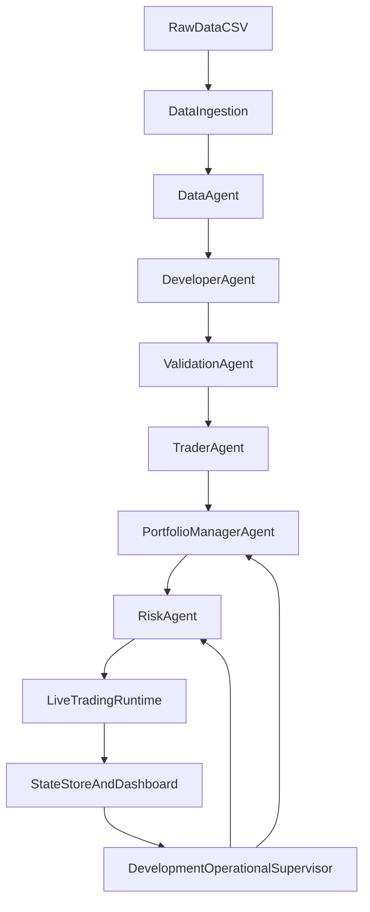

# Arquitectura Completa del TFM

## 1. Propósito de este documento

Este documento actúa como descripción maestra del sistema actualmente implementado en el repositorio. Su función no es solo enumerar módulos, sino explicar con criterio técnico cómo se encadenan los datos, los agentes, los servicios cuantitativos, la capa de ejecución y la observabilidad para construir una plataforma experimental de trading algorítmico orientada a un TFM.

El objetivo del proyecto, en términos operativos, es disponer de una arquitectura capaz de:

- descargar y mantener históricos de mercado sobre el universo de trabajo;
- transformar esos datos en datasets explotables por un pipeline cuantitativo reproducible;
- generar reglas candidatas de trading;
- validarlas con un esquema multicapa antes de promover un trader;
- activar traders promovidos en un runtime operativo D1;
- coordinar señales simultáneas mediante un `PortfolioManagerAgent` basado principalmente en PPO;
- supervisar la salud de los traders y filtrar la cartera mediante un `RiskAgent`;
- persistir todo el proceso para su auditoría posterior desde SQLite y Streamlit.

Este documento se centra exclusivamente en lo que está soportado por el código actual. La contextualización específica sobre Darwinex Zero, sus requisitos formales o su encaje institucional puede añadirse en otro texto complementario si se desea, pero no se desarrolla aquí más allá de reconocer que la arquitectura está diseñada para desplegar operativa real o semirreal conectada a MetaTrader 5.

## 2. Visión general del sistema

La arquitectura puede entenderse como un ciclo cerrado con cinco planos:

1. `Datos`: descarga de históricos, mantenimiento del universo y normalización a OHLC.
2. `Desarrollo cuantitativo`: construcción de features, split temporal, target y generación de reglas.
3. `Validación y promoción`: filtros estadísticos y selección final de reglas robustas.
4. `Operación`: activación del trader, evaluación diaria de señales, rebalanceo de cartera, control de riesgo y enrutado al broker.
5. `Persistencia y observabilidad`: almacenamiento de estados, eventos, métricas, artefactos y visualización en dashboard.

El flujo principal real es el siguiente:

En términos funcionales, la secuencia extremo a extremo es:

1. Se actualizan o descubren datos de acciones y ETFs.
2. El `DataAgent` produce un `DatasetContract`.
3. El `DeveloperAgent` crea el experimento, genera features, divide el histórico y produce reglas candidatas.
4. El `ValidationAgent` valida esas reglas y, si procede, crea un `PromotedTraderSpec`.
5. El `TraderAgent` activa el trader promovido y lo pone en estado `LIVE`.
6. El supervisor recalcula el backtest del trader promovido y persiste artefactos reutilizables.
7. El `PortfolioManagerAgent` sincroniza el universo promovido, construye dataset semanal y entrena o ajusta su política PPO.
8. El `LiveTradingRuntime` procesa nuevas velas D1, detecta señales, consulta al portfolio manager y posteriormente al `RiskAgent`.
9. El `TraderAgent` envía órdenes y cierres a través de `ExecutionRouter`.
10. El `StateStore` registra todo el proceso y el dashboard lo expone de forma interpretable.

## 3. Estructura principal del repositorio

### 3.1. Núcleo `app/`

La carpeta `app/` concentra prácticamente toda la lógica de dominio:

| Ruta | Finalidad |
|---|---|
| `app/agents/` | Agentes del sistema: datos, desarrollo, validación, trader, portfolio y riesgo. |
| `app/contracts/` | Enums y dataclasses compartidas por todos los módulos. |
| `app/services/` | Servicios cuantitativos reutilizables y stack PPO del portfolio. |
| `app/runtime/` | Supervisor principal y runtime operativo D1. |
| `app/orchestrator/` | Orquestadores alternativos de simulación y retraining basado en eventos. |
| `app/execution/` | Router de ejecución, integración MT5, modelos de orden y providers de datos. |
| `app/storage/` | Persistencia SQLite del estado completo del sistema. |
| `app/ui/` | Dashboard Streamlit y agregación de snapshots. |
| `app/core/` | Logging estructurado y utilidades transversales. |
| `app/tests/` | Pruebas unitarias e integraciones sobre contratos, runtime, portfolio y riesgo. |

### 3.2. Otras carpetas relevantes

| Ruta | Finalidad |
|---|---|
| `datos/Stocks/` | CSV diarios de acciones. |
| `datos/ETFs/` | CSV diarios de ETFs. |
| `datos/_universe/` | Universo congelado o reconstruido desde MT5. |
| `app/toolbox/data_download/` | Script de mantenimiento del universo y descarga masiva de históricos. |
| `app/toolbox/backtest_eventos/` | Motor de backtest histórico basado en eventos (envoltura sobre `pyeventbt`). |
| `app/toolbox/indicators/` | Librería de features técnicas (`build_feature_library`, `validate_feature_frame`). |
| `app/toolbox/particion_IS_OOS/` | Split temporal IS/OOS/holdout. |
| `app/toolbox/definicion_target/` | Aplicación del target a los bloques. |
| `app/toolbox/ML_tools/` | Generadores de reglas (decision tree, rulefit, genético, quantile). |
| `app/validation/` | Implementación cuantitativa de la validación multicapa (`monos.py`, `correlation.py`, `forward.py`, `stability.py`). |
| `docs/` | Documentación por fases y documentos de memoria técnica. |

## 4. Capa de datos

## 4.1. Papel de los datos dentro del proyecto

Los datos no son un simple input genérico. En esta arquitectura desempeñan cuatro funciones diferentes:

1. `Datos de precio diarios`: son la materia prima para construir features, targets, señales y backtests.
2. `Datos corporativos auxiliares`: volumen, dividendos, splits y metadatos de símbolo; aunque no siempre se consumen en toda la tubería, sí se preservan en los CSV originales.
3. `Datos derivados semanales`: retornos semanales y máscaras de actividad histórica por trader, usados por el PPO de cartera.
4. `Datos operativos`: snapshots de cuenta, posiciones abiertas, decisiones de cartera, auditoría de señales y estados de agentes/traders.

En consecuencia, el proyecto no trabaja con un único dataset, sino con una cadena de representaciones sucesivas del dato:

- CSV crudo descargado;
- OHLC limpio para desarrollo y runtime;
- feature frame enriquecido;
- bloques temporales `IS`, `OOS` y `holdout`;
- reglas candidatas;
- artefactos de backtest por trader;
- dataset semanal de cartera;
- snapshots operativos live.

## 4.2. Descarga y construcción del universo

La descarga vive fuera del `DataAgent`, en `app/toolbox/data_download/download.py`. Esta decisión es importante: el sistema separa explícitamente el mantenimiento del universo y de los históricos frente al consumo operativo de esos datos.

El script de descarga realiza tres tareas:

1. Prepara directorios de trabajo (`datos/Stocks`, `datos/ETFs`, `datos/_universe`).
2. Construye el universo de símbolos.
3. Descarga o actualiza históricos diarios desde Yahoo Finance.

### 4.2.1. Cómo se construye el universo

El universo puede construirse por tres vías:

- reconstrucción desde MT5, mediante `MetaTrader5.symbols_get()`;
- uso de listas congeladas ya existentes en `datos/_universe/`;
- listas manuales definidas en el propio script.

Cuando se reconstruye desde MT5, el script clasifica símbolos mediante una heurística basada en:

- nombre;
- `path`;
- descripción;
- exclusión de categorías no deseadas como `forex`, índices, commodities, metales, futuros, cripto, bonos u opciones;
- detección específica de `ETF` y `Stock`.

El resultado se persiste en:

- `datos/_universe/dz_stocks.txt`;
- `datos/_universe/dz_etfs.txt`;
- `datos/_universe/dz_universe_full.csv`;
- `datos/_universe/mt5_all_symbols_raw.csv`.

### 4.2.2. Qué se descarga

La descarga se hace con `yfinance`, en frecuencia `1d`, con:

- `Open`;
- `High`;
- `Low`;
- `Close`;
- `Adj Close`;
- `Volume`;
- `Dividends`;
- `Stock Splits`;
- símbolo bruto de origen (`RawSymbol`);
- símbolo resuelto para Yahoo (`YahooSymbol`).

Por tanto, el CSV descargado es más rico que el mínimo consumido después por los agentes. El pipeline clásico trabaja sobre OHLC, pero el fichero fuente preserva más información para trazabilidad y posibles extensiones.

### 4.2.3. Política de actualización

Para cada símbolo:

- si ya existe CSV, se detecta la última fecha disponible y solo se descarga desde el día siguiente;
- si no existe, se arranca desde una fecha por defecto (`2000-01-01`);
- se resuelven distintas variantes del ticker para Yahoo;
- se reintenta la descarga varias veces con backoff creciente;
- se eliminan duplicados por fecha conservando la última observación;
- se registra el estado final como `updated`, `up_to_date` o `failed`.

La salida agregada del proceso se guarda además en:

- `datos/update_log.csv`;
- `datos/failed_symbols.csv`.

## 4.3. Normalización e ingesta en la aplicación

La aplicación no consume directamente el CSV descargado en bruto. Primero lo normaliza.

### 4.3.1. Servicio `load_asset_ohlc`

`app/services/data_service.py` define `load_asset_ohlc`, que convierte un CSV estilo Yahoo a la representación estándar interna:

- índice temporal (`DatetimeIndex`);
- columnas `open`, `high`, `low`, `close`.

El servicio:

1. renombra `Date/Open/High/Low/Close`;
2. exige la presencia de `date`, `open`, `high`, `low`, `close`;
3. parsea fechas;
4. ordena por fecha;
5. convierte OHLC a numérico;
6. elimina filas inválidas;
7. lanza excepción si el resultado queda vacío.

Esta normalización es clave porque fija el contrato mínimo del dato sobre el que trabajan tanto el desarrollo cuantitativo como parte del runtime.

### 4.3.2. `LocalMarketDataProvider`

`app/execution/local_data_provider.py` descubre automáticamente todos los CSV en `datos/Stocks` y `datos/ETFs`, crea el mapeo símbolo -> ruta y expone métodos para:

- recuperar la última barra;
- conocer el rango temporal disponible;
- comprobar si un símbolo existe;
- invalidar caché tras un refresh.

Esto permite reutilizar la misma base local de datos tanto en desarrollo como en la operativa en modo local o en pasos intermedios del supervisor.

## 4.4. Tipos de datos utilizados realmente

Aunque el sistema parte de CSV diarios, durante su operación maneja varios tipos de dato diferenciados:

| Tipo | Forma | Uso principal |
|---|---|---|
| OHLC diario | `DataFrame` indexado por fecha | desarrollo de features, validación y backtests |
| Feature frame | `DataFrame` de indicadores | evaluación de reglas y creación de señales |
| Bloques temporales | `data_is`, `data_oos`, `data_2025` | validación multicapa |
| Reglas candidatas | `DataFrame` por familia y lado | entrada del `ValidationAgent` |
| Reglas estables | listas de strings | construcción del trader promovido |
| Curvas de equity / balance | `DataFrame` | backtest, portfolio y riesgo |
| Trades históricos | `DataFrame` | métricas de diseño, forward y salud |
| Retornos semanales | series normalizadas | entrenamiento e inferencia PPO |
| Máscara semanal de actividad | serie binaria por trader | distinguir cuándo un trader estaba realmente activo |
| Eventos y snapshots | JSON persistido | auditoría, dashboard y reanudación operativa |

## 5. Contratos comunes del sistema

Los contratos residen principalmente en:

- `app/contracts/enums.py`;
- `app/contracts/models.py`;
- `app/contracts/__init__.py`.

Su función es desacoplar agentes, servicios y runtimes, de forma que el sistema se comporte como una arquitectura modular y no como una colección de scripts ad hoc.

### 5.1. Enums principales

`app/contracts/enums.py` define el vocabulario operativo del sistema:

- `AgentKind`: identifica agentes productores o consumidores de decisiones.
- `AgentStatus`: estado operativo de cada agente (`idle`, `running`, `failed`, `blocked`).
- `TraderLifecycleState`: ciclo de vida binario del trader (`live`, `retraining`). El trader o esta operando en produccion (`live`), o esta fuera con peso 0 esperando reentrenamiento (`retraining`). No existen estados intermedios tipo "warning amber".
- `RiskAction`: vocabulario compartido del `RiskAgent`, tanto para salud de traders como para gate de cartera.
- `EventType`: tipología completa de eventos persistidos, incluyendo desarrollo, validación, portfolio, riesgo y broker.

### 5.2. Dataclasses principales

Las dataclasses de `app/contracts/models.py` recogen el contrato formal del pipeline:

| Tipo | Finalidad |
|---|---|
| `DatasetContract` | Describe un dataset ya preparado por el `DataAgent`. |
| `ExperimentConfig` | Formaliza el experimento de desarrollo: activo, timeframe, familias y parámetros. |
| `CandidateRules` | Resume las reglas candidatas generadas. |
| `ValidationReport` | Sintetiza el resultado de la validación. |
| `PromotedTraderSpec` | Define un trader promovido: reglas, activo, timeframe y origen. |
| `TraderLiveMetrics` | Snapshot de métricas live del trader. |
| `PortfolioDecision` | Decisión de cartera emitida por el `PortfolioManagerAgent`. |
| `PortfolioTrainingRun` y `PortfolioModelInfo` | Trazan cada entrenamiento PPO y el modelo vigente. |
| `PortfolioRebalanceSnapshot` y `PortfolioForwardEvaluation` | Persisten decisiones históricas de cartera y sus evaluaciones forward. |
| `DesignRiskProfile`, `TraderForwardMetrics`, `TraderHealthSnapshot`, `RiskAdjustedPortfolioDecision` | Contratos avanzados del `RiskAgent`. |
| `RetrainRequest` | Solicitud formal de retraining. |
| `EventRecord` | Estructura abstracta de evento persistido. |

### 5.3. Observación importante sobre la calidad del dataset

`DatasetContract` incluye un `quality_score`, pero en la implementación actual el `DataAgent` lo fija en `1.0`. Por tanto, existe el campo contractual, pero no una auditoría automática avanzada de calidad del dataset en esta capa.

## 6. Agentes del sistema

## 6.1. `AgentContext`

Antes de explicar cada agente, conviene describir `AgentContext` (`app/agents/base.py`), que es el objeto de contexto compartido por todos ellos. Contiene:

- `store`;
- `artifacts_root`;
- `execution_router`.

Este diseño permite que los agentes no conozcan detalles innecesarios de persistencia o ejecución, y se comuniquen a través de contratos estables.

## 6.2. `DataAgent`

### 6.2.1. Función dentro del flujo

`DataAgent` es el primer agente del pipeline formal. Su cometido no es descargar datos desde Internet, sino tomar un activo ya disponible localmente y transformarlo en un contrato de dataset coherente con el resto del sistema.

### 6.2.2. Qué hace exactamente

`app/agents/data_agent.py` implementa `prepare_dataset(...)`, que:

1. marca el agente como `running`;
2. emite el log `dataset_load_started`;
3. llama a `load_asset_ohlc(...)`;
4. construye un `DatasetContract` con:
   - `dataset_id`,
   - `asset`,
   - `timeframe`,
   - `source_path`,
   - número de filas,
   - fecha inicial y final,
   - `quality_score`,
   - metadata;
5. persiste un evento `DATASET_READY`;
6. emite log estructurado `dataset_ready`;
7. deja el agente en `idle`.

### 6.2.3. Valor metodológico

Aunque su lógica es sencilla, `DataAgent` cumple una función arquitectónica importante:

- formaliza la entrada al pipeline;
- desacopla la ingesta de la fase de desarrollo;
- deja traza persistente del dataset realmente utilizado.

En otras palabras, convierte un fichero en un objeto de trabajo auditado.

## 6.3. `DeveloperAgent`

### 6.3.1. Papel metodológico

`DeveloperAgent` es el responsable de transformar un dataset bruto ya normalizado en un experimento cuantitativo completo. Es el agente donde se construyen los predictores, se fija la partición temporal del problema y se generan las reglas candidatas.

### 6.3.2. Secuencia interna

`app/agents/developer_agent.py` implementa `develop(...)`, que sigue esta secuencia:

1. recibe un `DatasetContract`;
2. recibe las familias de modelos a probar;
3. fija una configuración de split con:
   - `is_pct`,
   - `oos_pct`,
   - `holdout_year`,
   - `lookback_years`;
4. persiste `DEVELOPMENT_STARTED`;
5. relee el CSV fuente y vuelve a normalizar columnas;
6. construye features con `build_features(...)`;
7. divide el histórico con `split_is_oos_holdout(...)`;
8. aplica el target con `apply_target_to_blocks(...)`;
9. persiste `SPLIT_AND_TARGET_READY`;
10. construye un `ExperimentConfig`;
11. genera reglas candidatas con `generate_candidate_rules(...)` usando únicamente `data_is`;
12. agrega las reglas de todas las familias;
13. crea `CandidateRules`;
14. persiste `CANDIDATE_RULES_READY`.

### 6.3.3. Sobre la doble lectura del CSV

Es relevante señalar que el `DeveloperAgent` no reutiliza directamente el `DataFrame` cargado por `DataAgent`, sino que vuelve a leer `dataset.source_path`. Esto introduce cierta redundancia, pero en la práctica mantiene un desacoplamiento claro: el contrato de dataset contiene la referencia al origen, y cada agente posterior reconstruye lo que necesita desde esa fuente.

### 6.3.4. Construcción de features

La construcción de features se delega en `app/services/feature_service.py`, que a su vez encapsula la librería de indicadores utilizada por el proyecto. La documentación existente del repositorio y los servicios asociados indican que el sistema trabaja sobre una biblioteca cerrada de indicadores técnicos clásicos, entre ellos:

- `Momentum`;
- `ROC`;
- `RSI`;
- `Stoch`;
- `WPR`;
- `CCI`;
- `BullsPower`;
- `BearsPower`;
- `DeMarker`;
- `RVI`;
- `DPO`.

La finalidad de esta capa es producir un espacio de representación consistente para evaluar reglas lógicas sobre el activo.

### 6.3.5. Partición temporal

La política declarada por el agente es `is_oos_holdout_2025`. Además, el propio `DeveloperAgent` registra en log una orientación específica:

- `IS` reciente;
- `OOS` más antiguo dentro del histórico utilizado;
- `holdout` correspondiente al año objetivo.

Esa elección es metodológicamente relevante porque la validación posterior no trabaja sobre cortes arbitrarios, sino sobre una segmentación temporal explícita y persistida.

### 6.3.6. Familias de generación

Según la configuración recibida, el agente puede emplear distintas familias:

- `decision_tree`;
- `rulefit`;
- `genetico` o `genetic`;
- `quantile`;

No todas tienen por qué ejecutarse en cada ciclo. De hecho, el supervisor puede escoger solo una familia por iteración de desarrollo, mientras que el pipeline offline global puede orquestar varias.

### 6.3.7. Salida formal

El resultado del agente es `DevelopmentOutput`, que contiene:

- `experiment_config`;
- `candidate_rules`;
- `blocks`;
- `candidates_by_family`.

Esta salida es suficiente para alimentar al `ValidationAgent` sin necesidad de volver a inferir la estructura del experimento.

## 6.4. `ValidationAgent`

### 6.4.1. Problema que resuelve

El proyecto no promociona traders por el simple hecho de haber generado reglas. Entre la generación y la promoción existe una fase de validación multicapa diseñada para reducir el riesgo de sobreajuste y exigir robustez temporal y estructural.

### 6.4.2. Pipeline de validación elegido

La implementación principal vive en `app/services/validation_service.py`. El comentario del servicio lo resume con claridad: la validación sigue el orden

`IS/OOS (monos) -> decorrelacion -> forward -> estabilidad`.

Ese orden se ha convertido en la metodología efectiva del proyecto.

### 6.4.3. Perfil por defecto

`DEFAULT_VALIDATION_PROFILE` define los parámetros base:

- `monkey_is`:
  - `n_monkeys = 120`
  - `is_pass_pct = 90.0`
  - `min_coverage_is = 80`
- `monkey_oos`:
  - `n_monkeys = 120`
  - `oos_pass_pct = 75.0`
  - `min_coverage_oos = 60`
- `correlation_pruning`:
  - `corr_threshold = 0.50`
  - `min_ops = 50`
- `forward_validation`:
  - `target_year = 2025`
  - `min_ops = 30`
- `stability_selection`:
  - `top_n_long = 15`
  - `top_n_short = 15`
  - `min_ops = 50`

Estos valores son especialmente relevantes para la memoria, porque muestran que la validación implementada no es un filtro trivial, sino una cadena de exigencias cuantitativas configurables.

### 6.4.4. Etapas de la validación

#### a) Validación tipo "monos" en `IS`

Sobre las reglas candidatas agrupadas por familia se ejecuta `monkey_validate_is_multi(...)`. Esta primera capa actúa como filtro inicial sobre el segmento de entrenamiento.

#### b) Validación tipo "monos" en `OOS`

Las reglas que superan la primera capa pasan a `monkey_validate_oos_multi(...)` sobre el bloque `OOS`, exigiendo persistencia del comportamiento fuera del tramo principal.

#### c) Decorrelación de P/L

Una vez filtradas por `IS` y `OOS`, se ejecuta `run_pl_correlation_pruning(...)` con el fin de descartar reglas excesivamente redundantes desde el punto de vista del comportamiento de P/L.

#### d) Validación forward anual

Las reglas decorrelacionadas se evalúan después sobre el año holdout mediante `validate_forward_year_profitability(...)`.

#### e) Selección por estabilidad

Finalmente, `run_pl_stability_selection(...)` selecciona los ganadores estables definitivos:

- `winners_long_stable`;
- `winners_short_stable`.

### 6.4.5. Implementación del `ValidationAgent`

`app/agents/validation_agent.py` recibe el `DevelopmentOutput`, ejecuta `run_validation_pipeline(...)` y construye un `ValidationReport`.

Si hay reglas estables suficientes:

1. crea un `PromotedTraderSpec` con `build_promoted_spec(...)`;
2. NO inserta al trader en `trader_states`: la fila en `trader_states` solo aparece cuando `TraderAgent.activate(...)` lo pone `LIVE`. Mientras tanto el trader vive en el evento `TRADER_PROMOTED` y en `_promoted_registry` como cola de validados pendientes;
3. persiste:
   - `VALIDATION_COMPLETED`,
   - `TRADER_PROMOTED`;
4. devuelve `ValidationOutput(report, promoted_spec)`.

### 6.4.6. Fallback defensivo

Hay un detalle metodológico importante: si la selección de estabilidad devuelve cero reglas, el agente activa un fallback defensivo y toma hasta cinco reglas long y cinco short desde los dataframes decorrelacionados (`decor_long`, `decor_short`).

Esto significa que:

- la validación ideal busca estabilidad;
- la implementación actual mantiene un mecanismo de continuidad para no bloquear toda la integración si la capa de estabilidad queda vacía.

Ese fallback debe explicarse como decisión de ingeniería, no como equivalencia conceptual estricta con "reglas estables".

### 6.4.7. Diferencia entre promoción permisiva y promoción estricta

`validate_and_promote(...)` acepta el parámetro `promote_if_empty`.

- Si `promote_if_empty=True`, el sistema puede seguir una vía más permisiva.
- Si `promote_if_empty=False`, si no hay reglas válidas tras la validación efectiva, no se promociona ningún trader.

Esta distinción es importante porque el supervisor de desarrollo utiliza la vía estricta en determinadas rutas operativas, mientras que otros orquestadores pueden ser más tolerantes.

## 7. Servicios cuantitativos reutilizables

La carpeta `app/services/` concentra la mayor parte de la lógica reutilizable no acoplada a un agente concreto.

### 7.1. Servicios del pipeline clásico

| Archivo | Finalidad |
|---|---|
| `app/services/data_service.py` | Normalización de CSV a OHLC estándar. |
| `app/services/feature_service.py` | Construcción y validación del frame de features. |
| `app/services/split_service.py` | División temporal `IS/OOS/holdout`. |
| `app/services/target_service.py` | Aplicación del target a los bloques. |
| `app/services/rule_generation_service.py` | Generación de reglas candidatas por familia. |
| `app/services/validation_service.py` | Orquestación completa de la validación multicapa. |
| `app/services/promotion_service.py` | Construcción del `PromotedTraderSpec`. |

### 7.2. Significado arquitectónico

La existencia de estos servicios permite:

- mantener a los agentes como orquestadores de alto nivel;
- reutilizar la lógica cuantitativa desde otros runtimes;
- probar bloques específicos sin ejecutar el sistema entero.

## 8. `TraderAgent` y ciclo de vida del trader

## 8.1. Qué significa "promocionar" frente a "activar"

En esta arquitectura, un trader solo tiene dos estados posibles en `trader_states`:

- `LIVE`: el trader ha sido activado por `TraderAgent` y está operando.
- `RETRAINING`: el trader ha sido sacado del LIVE por el `RiskAgent` y está pendiente de reentrenamiento (peso 0, todo a cash).

La promoción (validación) NO crea fila en `trader_states`: solo emite el evento `TRADER_PROMOTED` y deja el spec en la cola de validados (`_promoted_registry`). Es la activación realizada por `TraderAgent.activate(...)` la que inserta al trader en `trader_states` con estado `LIVE`. Promoción y activación, por tanto, no son sinónimos: la primera certifica que el trader pasa la validación, la segunda lo pone realmente en producción.

## 8.2. Función del `TraderAgent`

`app/agents/trader_agent.py` implementa el agente de activación y de acceso a ejecución.

Sus funciones principales son:

- `activate(promoted)`;
- `publish_metrics(metrics)`;
- `route_order(...)`;
- `close_position(...)`.

## 8.3. Qué hace `activate(...)`

La activación:

1. marca el agente como `running`;
2. emite `trader_activation_started`;
3. construye unas `TraderLiveMetrics` iniciales;
4. fija el estado del trader en `LIVE`;
5. persiste métricas iniciales en `trader_metrics_latest`;
6. emite:
   - `TRADER_STATE_CHANGED`,
   - `TRADER_METRICS_UPDATED`;
7. vuelve a `idle`.

Las métricas iniciales son deliberadamente simples:

- `pnl = 0`;
- `sharpe_rolling = 0`;
- `drawdown_rolling = 0`;
- `trade_count = 0`;
- `readiness_score` derivado del número de reglas long y short.

Esto deja claro que `TraderAgent.activate` no arranca por sí mismo un bucle autónomo completo de mercado. Prepara el trader para ser explotado por el runtime operativo.

## 8.4. Ejecución de órdenes

Cuando se le solicita operar:

1. crea un `OrderIntent`;
2. llama al `ExecutionRouter` con `actor=self.agent_id`;
3. captura posibles `PermissionError`;
4. persiste eventos de broker aceptados o rechazados;
5. deja traza estructurada del intento.

Esta capa aporta trazabilidad y control de acceso: no cualquier módulo puede interactuar directamente con el broker.

## 9. `PortfolioManagerAgent` en profundidad

## 9.1. Problema que resuelve

Una vez existen varios traders promovidos y activos, el sistema ya no puede operar todas las señales al mismo tiempo sin una política de asignación de capital. El `PortfolioManagerAgent` resuelve precisamente este problema:

- decide qué señales activas entran en cartera;
- asigna pesos objetivo a cada trader seleccionado;
- determina el peso residual en caja;
- persiste decisiones, entrenamientos y evaluaciones forward para su auditoría.

La cartera no es, por tanto, un accesorio del runtime, sino una capa de decisión estratégica situada entre la generación de señales y la ejecución.

## 9.2. Dos modos de funcionamiento

`app/agents/portfolio_agent.py` soporta dos modos:

- `ppo`: modo principal actual;
- `legacy`: modo de referencia y compatibilidad.

El modo se controla mediante `PORTFOLIO_MANAGER_MODE` y, en la práctica, el sistema actual está construido alrededor del camino PPO.

## 9.3. Filosofía del modo PPO

El enfoque PPO parte de una idea distinta a la del pipeline de reglas:

- los traders individuales ya fueron seleccionados por validación;
- la cartera aprende ahora a coordinar esos traders como activos de una cartera secuencial;
- el objetivo es optimizar una política de asignación de pesos, no inventar nuevas reglas de mercado.

Por eso la capa `app/services/portfolio_rl/` consume artefactos derivados de traders ya promovidos, especialmente:

- retornos históricos;
- máscaras de actividad;
- metadatos de promoción;
- curvas derivadas de backtest.

## 9.4. Configuración PPO

La configuración se centraliza en `app/services/portfolio_rl/config.py` mediante `PPOPortfolioConfig`.

Entre los parámetros más relevantes se encuentran:

### 9.4.1. Configuración temporal y del dataset

- `weekly_frequency = "W-FRI"`;
- `forward_horizon_weeks = 52`;
- `min_history_weeks = 52`;
- `initial_training_min_weeks = 104`;
- `fine_tune_window_weeks = 104`;
- `train_split = 0.65`;
- `val_split = 0.20`.

### 9.4.2. Costes y penalizaciones

- `transaction_cost_rate = 0.0010`;
- `lambda_turnover = 0.05`;
- `lambda_concentration = 0.02`;
- `lambda_dd = 0.25`;
- `lambda_cash = 0.0`;
- `dd_soft_limit = 0.15`;
- `cash_soft_limit = 0.60`.

### 9.4.3. Hiperparámetros PPO

- `gamma = 0.99`;
- `gae_lambda = 0.95`;
- `clip_epsilon = 0.20`;
- `entropy_coef = 0.01`;
- `value_loss_coef = 0.50`;
- `learning_rate = 3e-4`;
- `batch_size = 64`;
- `ppo_epochs = 6`;
- `max_grad_norm = 0.5`;
- `max_updates_initial = 30`;
- `max_updates_fine_tune = 12`.

### 9.4.4. Arquitectura y restricciones live

- `hidden_dim_encoder = 64`;
- `hidden_dim_head = 128`;
- `dropout = 0.05`;
- `max_weight_per_trader = 0.15`;
- `min_live_weight = 0.01`;
- `cash_bias = 0.0`.

### 9.4.5. Score de evaluación

La configuración incluye un diccionario `score_weights`, pero la evaluación efectiva en el código de PPO utiliza de manera explícita una combinación centrada sobre todo en:

- `net_sharpe`;
- `max_drawdown`.

Esto conviene explicarlo así en la memoria: existen pesos configurables declarados, pero la fórmula efectivamente usada por el evaluador es más concreta.

## 9.5. Construcción del dataset de cartera

El `PortfolioManagerAgent` no opera directamente sobre precios de mercado sin procesar. Primero sincroniza el universo promovido mediante `sync_universe(...)` y luego construye un dataset maestro.

### 9.5.1. Universo maestro

`sync_universe(...)` guarda internamente los `PromotedTraderSpec` y, si existe `UniverseRegistry`, los persiste en el store como universo elegible de cartera.

### 9.5.2. Dataset semanal

`_build_master_dataset(...)` delega en `PortfolioDatasetBuilder`. Este dataset utiliza, por trader:

- retornos semanales;
- máscara semanal real de actividad cuando está disponible;
- metadatos de promoción;
- features por trader;
- features globales del conjunto.

Si faltan algunas piezas, el sistema puede recurrir a una máscara proxy. Eso significa que el PPO intenta apoyarse preferentemente en actividad histórica real, pero conserva una vía de degradación controlada cuando el material persistido aún no es completo.

## 9.6. Política, acción y recompensa

La política PPO, implementada en `policy.py`, es de tipo actor-crítico y está diseñada para tratar un conjunto de traders más que una secuencia fija de activos.

Sus rasgos principales son:

- encoder compartido por trader;
- agregación permutation-invariant;
- enmascarado de traders inactivos;
- generación de pesos no negativos;
- suma total unitaria incluyendo caja.

La acción del agente es un vector de pesos objetivo sobre traders activos y un peso residual de caja.

La recompensa del entorno semanal combina:

- retorno neto;
- coste de transacción;
- penalización por turnover;
- penalización por concentración;
- penalización por drawdown;
- penalización opcional por caja excesiva.

En otras palabras, no se optimiza solo rentabilidad, sino utilidad ajustada por fricción y robustez.

## 9.7. Entrenamiento inicial y `fine-tuning`

### 9.7.1. Entrenamiento inicial

`ensure_initial_model_ready(...)`:

1. construye el dataset maestro;
2. obtiene los splits temporales;
3. comprueba si ya existe modelo vigente;
4. si no existe, lanza un `initial_train`;
5. persiste el resultado completo.

### 9.7.2. Ajuste mensual

`run_monthly_refresh_and_fine_tune(...)`:

1. reconstruye el dataset con los artefactos refrescados;
2. verifica si el modelo ya fue ajustado en el mes actual;
3. si no, lanza un `fine_tune`;
4. persiste la nueva versión.

Este diseño evita reentrenar indiscriminadamente y establece un ritmo rolling de actualización.

## 9.8. Persistencia de resultados PPO

`_persist_training_result(...)` persiste:

- `portfolio_training_runs`;
- `portfolio_training_metrics`;
- `portfolio_model_registry`;
- `portfolio_rebalance_snapshots`;
- `portfolio_forward_evaluations`;
- eventos `PORTFOLIO_TRAINING_RUN` y `PORTFOLIO_MODEL_UPDATED`.

Esto permite reconstruir tanto la historia de entrenamiento como las decisiones offline del agente de cartera.

## 9.9. Inferencia live

`rebalance_active_signals(...)` es la API principal utilizada por el runtime en vivo.

Su secuencia es:

1. descubrir sistemas activos;
2. si el modo es `legacy`, ir por la rama antigua;
3. si no hay señales activas, devolver estado vacío;
4. asegurar que existe modelo PPO inicial;
5. cargar el último snapshot previo, si existe;
6. ejecutar inferencia con `PPOInferenceService`;
7. construir tablas y figuras para UI;
8. devolver:
   - seleccionados;
   - pesos;
   - asignación en euros;
   - comparativas;
   - figuras;
   - metadata de modelo y decisión.

Si el camino PPO falla por cualquier motivo, la implementación cae a un fallback `legacy`. Esto es importante: la arquitectura principal es PPO, pero mantiene una vía de degradación operativa.

## 9.10. Modo `legacy`

El modo `legacy` se conserva como baseline y soporte transicional. Conceptualmente:

- la selección se basa en un genético;
- el fitness usa el número de condición;
- los pesos se resuelven mediante HRP o equal weight.

Sin embargo, este ya no es el corazón metodológico del sistema y no debe confundirse con la arquitectura principal actual.

## 10. `RiskAgent` en la arquitectura actual

## 10.1. Papel dual del riesgo

El `RiskAgent` cumple dos funciones distintas pero complementarias:

1. `supervisión de salud de trader`: evalúa si un trader promovido o live sigue alineado con su perfil de diseño;
2. `gate pre-trade de cartera`: revisa la decisión del `PortfolioManagerAgent` antes de que se materialice en órdenes.

Esta separación es metodológicamente muy valiosa porque desacopla:

- la calidad estructural del trader en el tiempo;
- el control instantáneo de exposición de la cartera.

## 10.2. Evaluación de salud del trader

`app/agents/risk_agent.py` implementa `evaluate_single_trader(...)` y `evaluate_trader_universe(...)`.

La secuencia por trader es:

1. reconstruir el universo promovido a partir de eventos `TRADER_PROMOTED`;
2. obtener o construir `DesignRiskProfile`;
3. lanzar un forward backtest post-promoción con `ForwardBacktestService`;
4. calcular `TraderForwardMetrics`;
5. evaluar la salud con `evaluate_trader_health(...)`;
6. persistir detalle, estado, evento de riesgo y posible `RetrainRequest`.

## 10.3. Pipeline mensual de riesgo

`should_run_monthly_evaluation(...)` considera que el riesgo debe reevaluarse:

- durante los tres primeros días del mes;
- o cuando han pasado al menos 30 días desde la última evaluación;
- o siempre que se fuerce manualmente.

`evaluate_trader_universe(...)` además crea y cierra `risk_evaluation_runs`, agregando el contador de traders enviados a reentrenamiento (`retraining_count`) y el de retrain requests emitidas.

## 10.4. Gate pre-trade de cartera

`review_portfolio_decision(...)` recibe una `PortfolioDecision` y la filtra según:

- drawdown de cuenta y `emergency stop`;
- estado del trader (`LIVE` se aprueba; `RETRAINING` se bloquea con peso 0 forzado a caja);
- peso máximo por trader;
- peso máximo por activo;
- exposición total máxima;
- buffer mínimo de caja;
- margen mínimo de broker, si se define.

Su salida es un `RiskAdjustedPortfolioDecision`, que puede:

- aprobar sin cambios;
- aprobar con clipping;
- reducir exposición;
- forzar caja;
- rechazar la cartera;
- activar `emergency_stop`.

## 10.5. Documento especializado de riesgo

La parte de riesgo cuenta además con un documento dedicado, `docs/risk_agent_memoria_tecnica.md`, que desarrolla con mucho más detalle:

- scoring de salud;
- perfiles de diseño;
- forward metrics;
- persistencia específica;
- dashboard de riesgo;
- validación mediante tests.

En este documento maestro el `RiskAgent` se integra dentro de la arquitectura global, mientras que el documento especializado profundiza en su diseño interno.

## 11. Supervisor, runtime y operación real

## 11.1. `DevelopmentOperationalSupervisor`

`app/runtime/development_operational_supervisor.py` es el centro operativo del sistema cuando se trabaja desde la UI. Su responsabilidad va mucho más allá de lanzar ciclos de desarrollo:

- crea el contexto compartido (`AgentContext`);
- instancia todos los agentes;
- mantiene el registro de traders promovidos;
- ejecuta backtests al promocionar;
- prepara artefactos para portfolio y riesgo;
- arranca y reinicia el runtime live;
- coordina refresh mensual, riesgo, retraining y PPO;
- expone snapshots consumibles por Streamlit.

### 11.1.1. Estado interno relevante

Mantiene, entre otros, estos campos:

- `_promoted_registry`;
- `_backtest_registry`;
- `_runtime`;
- `_status`;
- información del último refresh de portfolio;
- información de la última evaluación de riesgo;
- marcas temporales de reentrenamientos y rebalanceos manuales.

### 11.1.2. Desarrollo continuo

Durante el desarrollo continuo el supervisor encadena:

1. `DataAgent.prepare_dataset`;
2. `DeveloperAgent.develop`;
3. `ValidationAgent.validate_and_promote`;
4. `TraderAgent.activate`;
5. recalculado de backtest del trader promovido;
6. persistencia de artefactos y actualización del registro interno.

## 11.2. Arranque del runtime operativo

El supervisor puede arrancar `LiveTradingRuntime` cuando existe masa crítica suficiente de traders. En la implementación actual, la lógica de `_ensure_operational_runtime(...)` exige un mínimo operativo de traders promovidos antes de levantar la operativa real, salvo forzado manual.

Este runtime se construye con:

- `TraderAgent`;
- `PortfolioManagerAgent`;
- `RiskAgent`;
- `MT5DataProvider` o provider equivalente;
- acceso al histórico mediante `history_loader`;
- proveedor de capital y de estado de universo.

## 11.3. Flujo mensual real

`run_portfolio_monthly_refresh(...)` implementa la secuencia operativa mensual efectiva:

1. refrescar OHLC de los símbolos promovidos;
2. recalcular backtests de traders promovidos;
3. ejecutar evaluación mensual de riesgo;
4. procesar `RetrainRequest` pendientes;
5. sincronizar el universo en el portfolio manager;
6. lanzar `run_monthly_refresh_and_fine_tune(...)` del PPO;
7. actualizar estado y snapshot visibles en la UI.

Esto significa que el refresh mensual no es solo "reentrenar PPO". Es un pipeline coordinado de datos, backtest, riesgo, retraining y cartera.

## 11.4. Acciones manuales

El supervisor expone además dos acciones manuales importantes:

- `force_portfolio_retraining_only()`;
- `force_portfolio_retraining_and_rebalance()`.

La primera fuerza refresh y reentrenamiento sin disparar un rebalanceo operativo inmediato. La segunda fuerza, además, un rebalanceo live a través del runtime.

## 11.5. Procesamiento de retraining

`process_pending_retrain_requests()` recorre la cola persistida de solicitudes y, por cada una:

1. marca la request como `running`;
2. vuelve a preparar dataset;
3. vuelve a desarrollar;
4. vuelve a validar;
5. activa el nuevo trader promovido;
6. recalcula backtest;
7. lo inserta en el runtime si este ya está activo;
8. marca la request como `completed` o `failed`.

Esto demuestra que el sistema no contempla el retraining como un simple flag, sino como una reejecución real del pipeline cuantitativo.

## 12. `LiveTradingRuntime`

## 12.1. Qué hace

`app/runtime/live_trading_runtime.py` es el bucle D1 que conecta señal, cartera, riesgo y ejecución.

Su función principal es:

1. escuchar nuevas velas cerradas;
2. reconstruir features actuales;
3. evaluar reglas long y short de los traders ligados a ese símbolo;
4. crear candidatos de apertura y cierre;
5. aplicar la política temporal de rebalanceo;
6. consultar al `PortfolioManagerAgent`;
7. consultar al `RiskAgent`;
8. abrir, cerrar o reintentar órdenes mediante `TraderAgent`.

## 12.2. Evaluación de señales

Para cada símbolo, el runtime:

- carga barras recientes;
- construye un `feature_row`;
- evalúa las reglas del trader con `DataFrame.eval(...)`;
- detecta:
  - señal long,
  - señal short,
  - ausencia de señal,
  - cambio de lado.

Si una señal desaparece o cambia de sentido, se generan candidatos de cierre. Si una señal aparece y no hay posición ya abierta del mismo lado, se genera un candidato de apertura.

## 12.3. Política temporal de despliegue y rebalanceo

El runtime distingue dos fases:

- `despliegue_inicial`;
- `rebalanceo_semanal`.

Las reglas actuales son:

- el primer despliegue no espera al lunes;
- una vez desplegada la cartera, el rebalanceo normal es semanal;
- por defecto, el día de rebalanceo es el lunes;
- si no toca rebalanceo y no hay forzado manual, la señal queda anotada como `waiting_next_monday`.

## 12.4. Integración portfolio -> riesgo -> ejecución

La lógica de `_process_signal_candidates(...)` es el núcleo operativo:

1. construye el conjunto de señales activas;
2. llama a `portfolio_manager.rebalance_active_signals(...)`;
3. convierte la salida en `PortfolioDecision`;
4. llama a `risk_agent.review_portfolio_decision(...)`;
5. ajusta pesos y euros según el resultado de riesgo;
6. actualiza el libro de señales;
7. persiste auditoría de señal;
8. enruta las órdenes aceptadas;
9. marca el rebalanceo como ejecutado.

Esto deja claro que el `RiskAgent` está insertado después de la decisión PPO y antes de la ejecución. No reemplaza a la cartera; la supervisa.

## 12.5. Reintentos y cierres

El runtime mantiene además:

- `_pending_orders`;
- `_pending_closures`.

Si una orden o un cierre fallan, se programa un reintento a 30 minutos y esa cola se persiste también en SQLite.

## 13. Capa de ejecución y conexión a MT5

## 13.1. `ExecutionRouter`

`app/execution/router.py` centraliza el acceso a ejecución. Sus responsabilidades principales son:

- enrutar órdenes de mercado;
- cerrar posiciones;
- devolver snapshots de cuenta y posiciones;
- decidir si opera en `paper` o `live_mt5`;
- aplicar control de acceso por actor.

## 13.2. Control de acceso

La ejecución no está abierta a cualquier módulo. `app/execution/access.py` restringe qué actores pueden:

- enviar órdenes;
- consultar cuenta;
- consultar posiciones.

Esto mejora la seguridad lógica del sistema y evita acoplar la capa de broker a cualquier clase interna.

## 13.3. `MT5Connector`

`app/execution/mt5_connector.py` encapsula la interacción real con MetaTrader 5:

- conexión al terminal;
- carga de credenciales desde `.env`;
- alta de símbolos en Market Watch;
- `order_check` y `order_send`;
- normalización de comentario y `magic`;
- cierre de posiciones;
- consulta de cuenta y posiciones.

## 13.4. Providers de datos

| Archivo | Finalidad |
|---|---|
| `app/execution/mt5_data_provider.py` | Obtiene velas cerradas desde MT5 y publica `DataEvent`. |
| `app/execution/local_data_provider.py` | Sirve históricos locales a partir de CSV. |
| `app/execution/local_d1_data_provider.py` | Variante local con patrón similar al provider MT5. |
| `app/execution/mt5_events.py` | Contratos de eventos de mercado. |

## 14. Persistencia, auditoría y trazabilidad

## 14.1. `StateStore`

`app/storage/state_store.py` es uno de los elementos más importantes del proyecto. Funciona como memoria persistente del sistema y evita que la UI o los runtimes dependan de estado efímero en memoria.

Persiste:

- estados de traders;
- estado de agentes;
- eventos de negocio;
- métricas live;
- órdenes pendientes;
- entrenamientos PPO;
- snapshots de rebalanceo;
- evaluaciones forward;
- artefactos y runs de backtest;
- perfiles de diseño y métricas forward de riesgo;
- checks de cartera de riesgo;
- auditoría de señales live.

## 14.2. Tablas principales por dominio

### 14.2.1. Núcleo del sistema

- `trader_states`;
- `agent_status`;
- `events`;
- `trader_metrics_latest`;
- `pending_orders`.

### 14.2.2. Portfolio PPO

- `portfolio_universe_registry`;
- `portfolio_training_runs`;
- `portfolio_training_metrics`;
- `portfolio_model_registry`;
- `portfolio_rebalance_snapshots`;
- `portfolio_forward_evaluations`.

### 14.2.3. Backtests por trader

- `trader_backtest_runs`;
- `trader_backtest_artifacts`;
- `trader_weekly_returns`;
- `trader_weekly_signal_mask`.

### 14.2.4. Riesgo

- `trader_design_profiles`;
- `risk_evaluation_runs`;
- `trader_forward_backtest_runs`;
- `trader_forward_metrics`;
- `risk_evaluation_details`;
- `retrain_requests`;
- `risk_portfolio_checks`;
- `trader_signal_audit`.

## 14.3. SQLite frente a JSONL

La arquitectura usa dos niveles de trazabilidad:

### SQLite

Se utiliza como fuente principal para:

- snapshots del dashboard;
- estado operativo actual;
- reconstrucción histórica estructurada;
- reanudación de colas y procesos;
- analítica persistida de portfolio y riesgo.

### JSONL estructurado

`app/core/structured_logging.py` escribe además en `app/.tmp/logs/runtime_flow.log`.

Este log cumple una función complementaria:

- troubleshooting fino;
- reconstrucción cronológica de flujos;
- depuración cuando el snapshot tabular no es suficiente.

## 15. Backtest y artefactos históricos

## 15.1. Motor de backtest

El backtest histórico principal vive en:

- `app/toolbox/backtest_eventos/runner.py`;
- `app/toolbox/backtest_eventos/rules_engine.py`.

El motor:

- prepara datos OHLC;
- interpreta reglas long y short;
- ejecuta el backtest;
- devuelve curvas y trades;
- sirve de base tanto a la UI como a los artefactos reutilizados por portfolio y riesgo.

## 15.2. Uso dentro del sistema

Los backtests no son solo una salida visual. También alimentan:

- la construcción del `DesignRiskProfile`;
- la generación de retornos semanales para cartera;
- la máscara semanal de actividad histórica;
- el refresco mensual del universo promovido.

## 16. Dashboard y observabilidad

## 16.1. Arquitectura de la UI

La UI principal está en:

- `app/ui/dashboard.py`;
- `app/ui/dashboard_data.py`.

Su estrategia es simple pero robusta:

- mantiene el supervisor en `st.session_state`;
- consulta SQLite para reconstruir snapshots;
- usa `load_dashboard_snapshot(...)` como agregador ligero de estado, eventos y resumen de riesgo;
- combina estado en memoria del supervisor con persistencia;
- muestra tablas, métricas y figuras por bloque funcional.

## 16.2. Qué observa cada pestaña

### `Desarrollo`

Muestra:

- controles de desarrollo;
- estado del ciclo actual;
- reporte por activo;
- traders desarrollados.

### `Backtest`

Muestra:

- reglas long y short;
- curvas históricas;
- métricas cuantitativas compactas.

### `Operativa`

Muestra:

- estado de MT5;
- operativa activa;
- órdenes pendientes;
- posiciones y reintentos;
- detalle de órdenes y motivos de rechazo.

### `Portfolio manager`

Muestra:

- modelo vigente;
- histórico de entrenamientos PPO;
- métricas y curvas `train/val/test`;
- asignación en euros;
- histórico de rebalanceos;
- evaluaciones forward;
- señales seleccionadas, descartadas y ejecutadas;
- acciones manuales de reentrenamiento y rebalanceo.

### `Risk Agent`

Muestra:

- KPIs de última evaluación;
- traders evaluados;
- scores y acciones;
- curvas de diseño frente a forward;
- historial de decisiones de riesgo;
- `portfolio risk checks`;
- requests de retraining pendientes.

## 16.3. Importancia para la memoria

La UI no es solo una capa cosmética. En este proyecto cumple una función metodológica:

- convierte el sistema en auditable;
- permite observar la evolución temporal del desarrollo y la operación;
- facilita contrastar entrenamiento, backtest, portfolio y riesgo desde un único punto.

## 17. Calendario operativo real

El sistema actual implementa tres ritmos temporales distintos.

## 17.1. Ritmo diario

- recepción de nuevas velas D1;
- evaluación de señales por trader;
- cierres por desaparición o cambio de lado;
- gestión de reintentos.

## 17.2. Ritmo semanal

- rebalanceo de cartera, normalmente los lunes;
- tras el despliegue inicial, no se rebalancea todos los días, sino con frecuencia semanal.

## 17.3. Ritmo mensual

- refresh de OHLC;
- recalculado de backtests;
- evaluación de riesgo del universo;
- procesamiento de requests de retraining;
- `fine_tuning` del PPO.

Este escalado temporal es una de las piezas más importantes del diseño: cada capa trabaja en el horizonte que tiene sentido para su función.

## 18. Validación mediante tests

El repositorio incluye pruebas automáticas que refuerzan varias de las piezas más relevantes de la arquitectura actual. Entre las más significativas están:

| Test | Cobertura principal |
|---|---|
| `app/tests/test_contracts_state_store.py` | contratos base y persistencia general |
| `app/tests/test_dashboard_snapshot.py` | reconstrucción del snapshot principal consumido por la UI |
| `app/tests/test_runtime_logs.py` | logging estructurado y trazabilidad básica del runtime |
| `app/tests/test_feature_library.py` | capa de features e indicadores |
| `app/tests/test_portfolio_ppo.py` | funcionamiento principal del bloque PPO |
| `app/tests/test_design_risk_profile_serialization.py` | serialización y persistencia del perfil de diseño de riesgo |
| `app/tests/test_risk_health_scoring.py` | scoring de salud del trader |
| `app/tests/test_risk_portfolio_gate.py` | revisión pre-trade de cartera por riesgo |
| `app/tests/test_state_store_risk_tables.py` | nuevas tablas de persistencia de riesgo |
| `app/tests/test_live_runtime_risk_integration.py` | integración entre runtime live y gate de riesgo |
| `app/tests/test_risk_agent_force_evaluation.py` | evaluación forzada de riesgo y su integración con el supervisor |

Desde el punto de vista de la memoria, esta batería no prueba todo el comportamiento del sistema, pero sí demuestra que el proyecto ya dispone de:

- validación de contratos y persistencia;
- comprobaciones específicas sobre portfolio PPO;
- pruebas focalizadas sobre riesgo y runtime;
- evidencias de integración entre componentes, no solo tests aislados de funciones auxiliares.

## 19. Limitaciones y notas metodológicas

Para que el documento sea útil como base de memoria, conviene dejar explícitas varias limitaciones del estado actual:

1. El `quality_score` del dataset existe contractual y estructuralmente, pero hoy no representa una auditoría sofisticada del dato.
2. El `DeveloperAgent` relee el CSV aunque el `DataAgent` ya haya normalizado el dataset.
3. El fallback del `ValidationAgent` puede promocionar reglas decorrelacionadas aunque no existan ganadores estables.
4. La ruta `legacy` sigue existiendo y debe documentarse como baseline, no como flujo principal.
5. Parte del comportamiento fino de los módulos externos de validación o toolbox depende de librerías del repositorio que no siempre están descritas con el mismo nivel de detalle interno que los agentes.
6. Existen diferencias entre rutas de simulación, rutas legacy y el flujo operativo principal actual, por lo que no conviene describirlas como idénticas.
7. La observación live del PPO y la observación de entrenamiento no son exactamente la misma representación en todos sus detalles.

## 20. Archivos más importantes para entender el sistema

Si hubiera que estudiar el proyecto leyendo un conjunto limitado de archivos, los más representativos hoy serían:

1. `app/toolbox/data_download/download.py`
2. `app/services/data_service.py`
3. `app/agents/developer_agent.py`
4. `app/services/validation_service.py`
5. `app/agents/validation_agent.py`
6. `app/agents/trader_agent.py`
7. `app/agents/portfolio_agent.py`
8. `app/services/portfolio_rl/config.py`
9. `app/agents/risk_agent.py`
10. `app/runtime/development_operational_supervisor.py`
11. `app/runtime/live_trading_runtime.py`
12. `app/storage/state_store.py`
13. `app/ui/dashboard.py`
14. `docs/risk_agent_memoria_tecnica.md`

## 21. Resumen final

La arquitectura actual del TFM ya no puede entenderse como un único algoritmo de trading ni como un conjunto aislado de backtests. El repositorio implementa un sistema multiagente completo donde cada capa tiene un papel definido:

- los datos se descargan, normalizan y tipan;
- el desarrollo cuantitativo genera reglas sobre un espacio de features consistente;
- la validación aplica una metodología multicapa antes de promover traders;
- el `TraderAgent` activa y ejecuta;
- el `PortfolioManagerAgent` coordina señales simultáneas con un enfoque PPO;
- el `RiskAgent` supervisa la salud de los traders y revisa la cartera antes de su ejecución;
- el supervisor organiza ciclos de desarrollo, refresh mensual y runtime live;
- SQLite y Streamlit convierten todo el proceso en auditable y observable.

En consecuencia, el proyecto ha evolucionado hacia una plataforma experimental y operativa de ciclo completo. Esta arquitectura permite documentar en la memoria no solo modelos o resultados aislados, sino una metodología integral de creación, validación, despliegue, asignación de capital y control de riesgo sobre sistemas de trading algorítmico.
