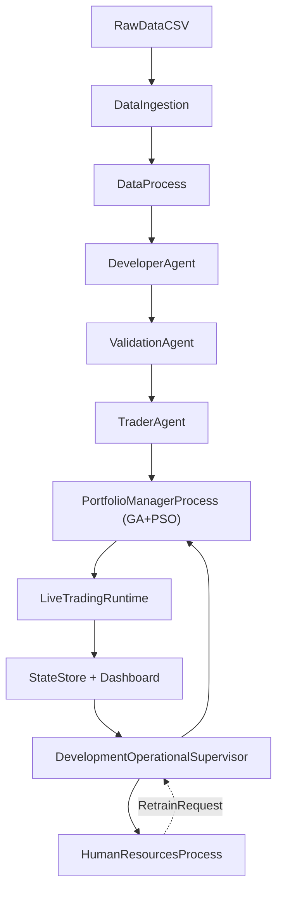

# Arquitectura Completa del TFM

## 1. Propósito de este documento

Este documento actúa como descripción maestra del sistema actualmente implementado en el repositorio. Su función no es solo enumerar módulos, sino explicar con criterio técnico cómo se encadenan los datos, los agentes y procesos, los servicios cuantitativos, la capa de ejecución y la observabilidad para construir una plataforma experimental de trading algorítmico orientada a un TFM.

El objetivo del proyecto, en términos operativos, es disponer de una arquitectura capaz de:

- descargar y mantener históricos de mercado sobre el universo de trabajo;
- transformar esos datos en datasets explotables por un pipeline cuantitativo reproducible;
- generar reglas candidatas de trading;
- validarlas con un esquema multicapa antes de promover un trader;
- activar traders promovidos en un runtime operativo D1;
- coordinar señales simultáneas mediante un `PortfolioManagerProcess` basado en un optimizador híbrido GA + PSO determinista;
- supervisar periódicamente la salud de los traders promovidos mediante un `HumanResourcesProcess` que decide si siguen válidos o si deben pasar a reentrenamiento;
- persistir todo el proceso para su auditoría posterior desde SQLite y Streamlit.

Este documento se centra exclusivamente en lo que está soportado por el código actual, tras dos refactorizaciones clave:

1. La sustitución del `PortfolioManagerAgent` (PPO/RL) por un `PortfolioManagerProcess` determinista basado en GA + PSO.
2. La sustitución del `RiskAgent` (que mezclaba salud de traders y gate pre-trade de cartera) por un `HumanResourcesProcess` enfocado únicamente en supervisar el ciclo de vida del trader (KEEP / RETRAINING).

La contextualización específica sobre Darwinex Zero, sus requisitos formales o su encaje institucional puede añadirse en otro texto complementario si se desea, pero no se desarrolla aquí más allá de reconocer que la arquitectura está diseñada para desplegar operativa real o semirreal conectada a MetaTrader 5.

## 2. Visión general del sistema

La arquitectura puede entenderse como un ciclo cerrado con cinco planos:

1. `Datos`: descarga de históricos, mantenimiento del universo y normalización a OHLC.
2. `Desarrollo cuantitativo`: construcción de features, split temporal, target y generación de reglas.
3. `Validación y promoción`: filtros estadísticos y selección final de reglas robustas.
4. `Operación`: activación del trader, evaluación diaria de señales, rebalanceo semanal de cartera y enrutado al broker.
5. `Persistencia y observabilidad`: almacenamiento de estados, eventos, métricas, artefactos y visualización en dashboard.

Una capa transversal vertical, asíncrona respecto al ciclo operativo, supervisa la salud de los traders ya promovidos:

6. `Supervisión de plantilla`: el `HumanResourcesProcess` revisa periódicamente cada trader vivo, lo compara con su perfil de diseño y, si su comportamiento forward se desvía, emite un `RetrainRequest` que el supervisor procesará para generar un sustituto.

El flujo principal real es el siguiente:



En términos funcionales, la secuencia extremo a extremo es:

1. Se actualizan o descubren datos de acciones y ETFs.
2. El `DataProcess` produce un `PreparedDataset`.
3. El `DeveloperAgent` crea el experimento, genera features, divide el histórico y produce reglas candidatas.
4. El `ValidationAgent` valida esas reglas y, si procede, crea un `PromotedTraderSpec`.
5. El `TraderAgent` activa el trader promovido y lo pone en estado `LIVE`.
6. El supervisor recalcula el backtest del trader promovido y persiste artefactos reutilizables (curvas, máscaras de actividad, retornos semanales).
 7. El `PortfolioManagerProcess` sincroniza el universo promovido y, en cada rebalanceo semanal, optimiza solo sobre el subconjunto de traders con señal activa y con histórico válido para asignar pesos.
8. El `LiveTradingRuntime` procesa nuevas velas D1, detecta señales, consulta al `PortfolioManagerProcess` cuando toca rebalancear y ejecuta órdenes.
9. El `TraderAgent` envía órdenes y cierres a través de `ExecutionRouter`.
10. Asíncronamente, el `HumanResourcesProcess` evalúa la salud de cada trader promovido (mensual o forzado) y, si detecta deterioro, emite un `RetrainRequest`.
11. El supervisor consume los `RetrainRequest` y reejecuta el pipeline cuantitativo para generar un sustituto.
12. El `StateStore` registra todo el proceso y el dashboard lo expone de forma interpretable.

## 3. Estructura principal del repositorio

### 3.1. Núcleo `app/`

La carpeta `app/` concentra prácticamente toda la lógica de dominio:

| Ruta | Finalidad |
|---|---|
| `app/agents/` | Agentes y procesos del sistema: desarrollador, validación, trader, gestor de cartera (`PortfolioManagerProcess`) y recursos humanos (`HumanResourcesProcess`). |
| `app/contracts/` | Enums y dataclasses compartidas por todos los módulos. |
| `app/services/` | Servicios cuantitativos reutilizables: datos, features, split, target, generación y validación de reglas, optimizador GA + PSO, salud de traders y servicios auxiliares de cartera. |
| `app/runtime/` | Supervisor principal y runtime operativo D1. |
| `app/orchestrator/` | Orquestadores alternativos de simulación y retraining basado en eventos. |
| `app/execution/` | Router de ejecución, integración MT5, modelos de orden y providers de datos. |
| `app/storage/` | Persistencia SQLite del estado completo del sistema. |
| `app/ui/` | Dashboard Streamlit y agregación de snapshots. |
| `app/core/` | Logging estructurado y utilidades transversales. |
| `app/cloud/` y `app/cloud_tasks/` | Configuración y tareas planificadas para despliegue cloud (S3, refresh mensual). |
| `app/tests/` | Pruebas unitarias e integraciones sobre contratos, runtime, optimizador, salud de traders y persistencia. |

### 3.2. Otras carpetas relevantes

| Ruta | Finalidad |
|---|---|
| `datos/Stocks/` | CSV diarios de acciones. |
| `datos/ETFs/` | CSV diarios de ETFs. |
| `datos/_universe/` | Universo congelado o reconstruido desde MT5. |
| `app/toolbox/data_download/` | Script de mantenimiento del universo y descarga masiva de históricos. |
| `app/toolbox/backtest_eventos/` | Motor de backtest histórico basado en eventos (envoltura sobre `pyeventbt`). |
| `app/toolbox/indicators/` | Librería de features técnicas (`build_feature_library`, `validate_feature_frame`). |
| `app/toolbox/particion_IS_OOS/` | Split temporal IS/OOS/holdout. |
| `app/toolbox/definicion_target/` | Aplicación del target a los bloques. |
| `app/toolbox/ML_tools/` | Generadores de reglas (decision tree, rulefit, genético, quantile). |
| `app/validation/` | Implementación cuantitativa de la validación multicapa (`monos.py`, `correlation.py`, `forward.py`, `stability.py`). |
| `infra/terraform/` | Despliegue cloud (EC2 Windows, S3, parámetros SSM). |
| `docs/` | Documentación de referencia (`arquitectura_completa_tfm.md`, cloud AWS, informe de refactor HR). |

## 4. Capa de datos

### 4.1. Papel de los datos dentro del proyecto

Los datos no son un simple input genérico. En esta arquitectura desempeñan cuatro funciones diferentes:

1. `Datos de precio diarios`: son la materia prima para construir features, targets, señales y backtests.
2. `Datos corporativos auxiliares`: volumen, dividendos, splits y metadatos de símbolo; aunque no siempre se consumen en toda la tubería, sí se preservan en los CSV originales.
3. `Datos derivados semanales`: retornos semanales y máscaras de actividad histórica por trader, usados por el optimizador de cartera y por el cálculo de salud post-promoción.
4. `Datos operativos`: snapshots de cuenta, posiciones abiertas, decisiones de cartera, auditoría de señales y estados de agentes/traders.

En consecuencia, el proyecto no trabaja con un único dataset, sino con una cadena de representaciones sucesivas del dato:

- CSV crudo descargado;
- OHLC limpio para desarrollo y runtime;
- feature frame enriquecido;
- bloques temporales `IS`, `OOS` y `holdout`;
- reglas candidatas;
- artefactos de backtest por trader;
- matriz semanal de retornos para el optimizador GA + PSO;
- snapshots operativos live.

### 4.2. Descarga y construcción del universo

La descarga vive fuera del `DataProcess`, en `app/toolbox/data_download/download.py`. Esta decisión es importante: el sistema separa explícitamente el mantenimiento del universo y de los históricos frente al consumo operativo de esos datos.

El script de descarga realiza tres tareas:

1. Prepara directorios de trabajo (`datos/Stocks`, `datos/ETFs`, `datos/_universe`).
2. Construye el universo de símbolos.
3. Descarga o actualiza históricos diarios desde Yahoo Finance.

#### 4.2.1. Cómo se construye el universo

El universo puede construirse por tres vías:

- reconstrucción desde MT5, mediante `MetaTrader5.symbols_get()`;
- uso de listas congeladas ya existentes en `datos/_universe/`;
- listas manuales definidas en el propio script.

Cuando se reconstruye desde MT5, el script clasifica símbolos mediante una heurística basada en nombre, `path`, descripción, exclusión de categorías no deseadas (`forex`, índices, commodities, metales, futuros, cripto, bonos u opciones) y detección específica de `ETF` y `Stock`.

El resultado se persiste en:

- `datos/_universe/dz_stocks.txt`;
- `datos/_universe/dz_etfs.txt`;
- `datos/_universe/dz_universe_full.csv`;
- `datos/_universe/mt5_all_symbols_raw.csv`.

#### 4.2.2. Qué se descarga

La descarga se hace con `yfinance`, en frecuencia `1d`, con `Open`, `High`, `Low`, `Close`, `Adj Close`, `Volume`, `Dividends`, `Stock Splits`, símbolo bruto de origen (`RawSymbol`) y símbolo resuelto para Yahoo (`YahooSymbol`).

El CSV descargado es por tanto más rico que el mínimo consumido después por los agentes. El pipeline clásico trabaja sobre OHLC, pero el fichero fuente preserva más información para trazabilidad y posibles extensiones.

#### 4.2.3. Política de actualización

Para cada símbolo:

- si ya existe CSV, se detecta la última fecha disponible y solo se descarga desde el día siguiente;
- si no existe, se arranca desde una fecha por defecto (`2000-01-01`);
- se resuelven distintas variantes del ticker para Yahoo;
- se reintenta la descarga varias veces con backoff creciente;
- se eliminan duplicados por fecha conservando la última observación;
- se registra el estado final como `updated`, `up_to_date` o `failed`.

La salida agregada se guarda en `datos/update_log.csv` y `datos/failed_symbols.csv`.

### 4.3. Normalización e ingesta en la aplicación

La aplicación no consume directamente el CSV descargado en bruto. Primero lo normaliza.

#### 4.3.1. Servicio `load_asset_ohlc` y `DataProcess`

`app/services/data_service.py` define dos elementos clave:

- `load_asset_ohlc(...)`: convierte un CSV estilo Yahoo a la representación estándar interna (DatetimeIndex, columnas `open`, `high`, `low`, `close`).
- `DataProcess`: proceso ligero (no es un agente deliberativo) con `agent_id = "data_process"` y método `prepare_dataset(...)`, que llama al loader, persiste el evento `DATASET_READY` y devuelve un `PreparedDataset` (con OHLC ya cargado en memoria) listo para el `DeveloperAgent`.

La normalización fija el contrato mínimo del dato: renombrar columnas Yahoo, exigir `date/open/high/low/close`, parsear fechas, ordenar, convertir a numérico, eliminar filas inválidas y lanzar excepción si el resultado queda vacío.

#### 4.3.2. `LocalMarketDataProvider`

`app/execution/local_data_provider.py` descubre automáticamente todos los CSV en `datos/Stocks` y `datos/ETFs`, crea el mapeo símbolo -> ruta y expone métodos para recuperar la última barra, conocer el rango temporal disponible, comprobar si un símbolo existe e invalidar caché tras un refresh.

Esto permite reutilizar la misma base local de datos tanto en desarrollo como en la operativa en modo paper o en pasos intermedios del supervisor.

### 4.4. Tipos de datos utilizados realmente

| Tipo | Forma | Uso principal |
|---|---|---|
| OHLC diario | `DataFrame` indexado por fecha | desarrollo de features, validación y backtests |
| Feature frame | `DataFrame` de indicadores | evaluación de reglas y creación de señales |
| Bloques temporales | `data_is`, `data_oos`, `data_2025` | validación multicapa |
| Reglas candidatas | `DataFrame` por familia y lado | entrada del `ValidationAgent` |
| Reglas estables | listas de strings | construcción del trader promovido |
| Curvas de equity / balance | `DataFrame` | backtest, optimizador y health scoring |
| Trades históricos | `DataFrame` | métricas de diseño, forward y salud |
| Retornos semanales | matriz `(T x N)` | optimizador híbrido GA + PSO |
| Máscara semanal de actividad | serie binaria por trader | distinguir cuándo un trader estaba realmente activo |
| Eventos y snapshots | JSON persistido | auditoría, dashboard y reanudación operativa |

## 5. Contratos comunes del sistema

Los contratos residen principalmente en:

- `app/contracts/enums.py`;
- `app/contracts/models.py`;
- `app/contracts/__init__.py`.

Su función es desacoplar agentes, servicios y runtimes, de forma que el sistema se comporte como una arquitectura modular y no como una colección de scripts ad hoc.

### 5.1. Enums principales

`app/contracts/enums.py` define el vocabulario operativo del sistema:

- `AgentKind`: identifica agentes y procesos productores o consumidores de decisiones (`data_process`, `developer_agent`, `validation_agent`, `trader_agent`, `portfolio_manager`, `human_resources_process`).
- `AgentStatus`: estado operativo de cada agente (`idle`, `running`, `failed`, `blocked`).
- `TraderLifecycleState`: ciclo de vida binario del trader (`live`, `retraining`). El trader o está operando en producción (`live`), o está fuera con peso 0 esperando reentrenamiento (`retraining`). No existen estados intermedios tipo "warning amber".
- `TraderReviewAction`: resultado de la revisión periódica del `HumanResourcesProcess`. Solo dos valores: `KEEP` (sigue válido) y `RETRAINING` (debe ser sustituido).
- `EventType`: tipología completa de eventos persistidos. Los más relevantes para las nuevas semánticas son `TRADER_PROMOTED`, `TRADER_STATE_CHANGED`, `PORTFOLIO_DECISION`, `PORTFOLIO_REBALANCE_SNAPSHOT`, `TRADER_HEALTH_EVALUATED`, `RETRAIN_REQUESTED` y `RETRAIN_PROCESSED`.

### 5.2. Dataclasses principales

Las dataclasses de `app/contracts/models.py` recogen el contrato formal del pipeline:

| Tipo | Finalidad |
|---|---|
| `DatasetContract` | Describe un dataset ya preparado por el `DataProcess`. |
| `ExperimentConfig` | Formaliza el experimento de desarrollo: activo, timeframe, familias y parámetros. |
| `CandidateRules` | Resume las reglas candidatas generadas. |
| `ValidationReport` | Sintetiza el resultado de la validación. |
| `PromotedTraderSpec` | Define un trader promovido: reglas, activo, timeframe y origen. |
| `TraderLiveMetrics` | Snapshot de métricas live del trader. |
| `PortfolioDecision` | Decisión semanal del `PortfolioManagerProcess` (modo `ga_pso`). Lleva `selected_traders`, `weights`, `target_cash_weight`, `fitness`, `sharpe_neto`, `mdd`, `corr_media` y `metadata` con la trazabilidad del optimizador. |
| `PortfolioRebalanceSnapshot` | Persistencia histórica de rebalanceos semanales (mismas claves que `PortfolioDecision` ampliadas con `forward_metrics` y diagnostics). |
| `TraderDesignProfile` | Perfil de diseño del trader: métricas IS / OOS / holdout en el momento de su promoción. Es el "DNI" contra el que se compara su comportamiento forward. |
| `TraderForwardMetrics` | Métricas forward post-promoción del trader: `shadow_*` (lo que sus reglas hicieron en datos OOS reales), `executed_*` (lo que finalmente ejecutó el broker), `signal_count` y `pm_selected_count`. |
| `TraderHealthConfig` | Umbrales de salud que utiliza `HumanResourcesProcess` para decidir entre `KEEP` y `RETRAINING`: `min_forward_trades_for_retraining`, `retraining_health_threshold`, `max_losing_streak_multiplier`, `max_drawdown_multiplier_retraining`, `min_profit_factor_ratio_retraining`, `min_sharpe_ratio_retraining`. **No contiene ni un solo campo de cartera, peso, margen o broker.** |
| `TraderHealthSnapshot` | Resultado de una revisión: previous_state, new_state, action (`KEEP`/`RETRAINING`), `health_score`, razones, `design_profile`, `forward_metrics`, flags y posible `retrain_request`. |
| `RetrainRequest` | Solicitud formal de reentrenamiento emitida por `HumanResourcesProcess` y consumida por el supervisor. |
| `EventRecord` | Estructura abstracta de evento persistido. |

### 5.3. Contratos eliminados respecto a la versión anterior

Para evitar confusión con documentación previa, conviene dejar registrado lo que ya **no existe**:

- `RiskAction`, `RiskDecision`, `RiskAdjustedPortfolioDecision`, `RiskLimitsConfig`, `DesignRiskProfile`, `RiskThresholds`: todos eliminados al rediseñar el componente como `HumanResourcesProcess`.
- `PortfolioTrainingRun`, `PortfolioModelInfo`, `PortfolioForwardEvaluation` (antiguos contratos del stack PPO): eliminados al sustituir PPO por el optimizador híbrido GA + PSO.

### 5.4. Observación importante sobre la calidad del dataset

El `DataProcess` deja `quality_score = 1.0` por defecto. Existe el campo contractual, pero no una auditoría automática avanzada de calidad del dataset en esta capa.

## 6. Agentes y procesos del sistema

### 6.1. Distinción entre "agente" y "proceso"

El proyecto usa con intención los dos términos:

- **Agente** (`...Agent`): componente con un cierto grado de decisión propia, normalmente con estado interno y vocación deliberativa. Ejemplos: `DeveloperAgent`, `ValidationAgent`, `TraderAgent`.
- **Proceso** (`...Process`): componente determinista, sin aprendizaje online, ejecutado en un horario definido (semanal o mensual) y reproducible desde su entrada. Ejemplos: `DataProcess`, `PortfolioManagerProcess` (GA + PSO), `HumanResourcesProcess`.

Esta distinción no es meramente estética: refleja un cambio arquitectónico real respecto a versiones anteriores del proyecto, donde tanto la cartera como el riesgo se modelaban como agentes con estado de aprendizaje. La arquitectura actual los reduce a procesos deterministas porque su responsabilidad es decidir, no aprender.

### 6.2. `AgentContext`

`app/agents/base.py` define `AgentContext`, el objeto compartido por todos ellos. Contiene:

- `store` (`StateStore`);
- `artifacts_root` (raíz para artefactos en disco);
- `execution_router` (opcional).

Este diseño permite que los agentes no conozcan detalles innecesarios de persistencia o ejecución, y se comuniquen a través de contratos estables.

### 6.3. `DataProcess`

`app/services/data_service.py` implementa `DataProcess` (`agent_id = "data_process"`).

- Cometido: tomar un activo ya disponible localmente y transformarlo en un dataset coherente con el resto del sistema.
- Método principal: `prepare_dataset(asset, timeframe, asset_csv_path)`.
- Hace: marcar `running` → `dataset_load_started` → `load_asset_ohlc(...)` → construir `PreparedDataset` → persistir evento `DATASET_READY` → log estructurado `dataset_ready` → volver a `idle`.

Aunque su lógica es sencilla, formaliza la entrada al pipeline, desacopla la ingesta de la fase de desarrollo y deja traza persistente del dataset realmente utilizado.

### 6.4. `DeveloperAgent`

`app/agents/developer_agent.py` transforma un dataset bruto ya normalizado en un experimento cuantitativo completo: features, partición temporal y reglas candidatas.

#### 6.4.1. Secuencia interna

`develop(...)`:

1. recibe un `DatasetContract` y las **familias de generación de reglas** a ejecutar (no son «modelos» predictivos autónomos ni capas por subgrupos: cada nombre es un pipeline distinto que, a partir del bloque IS, produce tablas de reglas long/short);
2. fija una configuración de split (`is_pct`, `oos_pct`, `holdout_year`, `lookback_years`);
3. persiste `DEVELOPMENT_STARTED`;
4. relee el CSV fuente y vuelve a normalizar columnas;
5. construye features con `build_features(...)`;
6. divide el histórico con `split_is_oos_holdout(...)`;
7. aplica el target con `apply_target_to_blocks(...)`;
8. persiste `SPLIT_AND_TARGET_READY`;
9. construye un `ExperimentConfig`;
10. genera reglas candidatas con `generate_candidate_rules(...)` usando únicamente `data_is`;
11. agrega las reglas de todas las familias;
12. crea `CandidateRules` y persiste `CANDIDATE_RULES_READY`.

#### 6.4.2. Construcción de features

Se delega en `app/services/feature_service.py`, que encapsula la librería de indicadores: `Momentum`, `ROC`, `RSI`, `Stoch`, `WPR`, `CCI`, `BullsPower`, `BearsPower`, `DeMarker`, `RVI`, `DPO`. La finalidad es producir un espacio de representación consistente sobre el que evaluar reglas lógicas.

#### 6.4.3. Partición temporal

La política declarada es `is_oos_holdout_2025`:

- `IS` reciente;
- `OOS` más antiguo dentro del histórico utilizado;
- `holdout` correspondiente al año objetivo.

Esta segmentación es metodológicamente relevante porque la validación posterior trabaja sobre cortes temporales explícitos y persistidos.

#### 6.4.4. Familias de generación de reglas

Implementación central: `generate_candidate_rules(...)` en `app/services/rule_generation_service.py`. Cuatro familias activas:

| Familia | Mecanismo (resumen) |
|---|---|
| `decision_tree` | Árboles de decisión multi-seed → reglas long/short. |
| `rulefit` | RuleFit multi-seed → reglas long/short. |
| `genetico` | Algoritmo genético sobre átomos de regla (`genetic` es alias del mismo generador). |
| `quantile` | Combinaciones de bins cuantílicos (`build_quantile_bin_combinations`). |

El bucle iterativo interno del `DeveloperAgent` (`_collect_rules`) reparte cupos de reglas con `target_n_rules` solo para las familias declaradas en `FAMILIES_WITH_RULE_TARGET`: `decision_tree`, `rulefit`, `genetico`, `genetic`. La familia `quantile` puede pasarse en `families=...` y genera candidatos en la misma llamada, pero **no** participa en ese reparto iterativo de cupos (usa otro perfil de parámetros).

En el **supervisor operativo** (`DevelopmentOperationalSupervisor`), cada ciclo de desarrollo elige **una sola familia al azar** entre `decision_tree`, `rulefit`, `genetico` y `quantile`. No existe un modo «subgrupo» ni una selección paralela de varios modelos de reglas por iteración: se rota el generador para diversificar el experimento.

En **tests y checks de integración** (por ejemplo `phase5_check`) a menudo se pasan **varias familias en una sola** llamada a `develop(...)` para ejercitar el encadenamiento completo.

### 6.5. `ValidationAgent`

#### 6.5.1. Pipeline de validación elegido

`app/services/validation_service.py` resume el orden:

`IS/OOS (monos) -> decorrelación -> forward -> estabilidad`.

#### 6.5.2. Perfil por defecto (`DEFAULT_VALIDATION_PROFILE`)

- `monkey_is`: `n_monkeys=120`, `is_pass_pct=90.0`, `min_coverage_is=80`.
- `monkey_oos`: `n_monkeys=120`, `oos_pass_pct=75.0`, `min_coverage_oos=60`.
- `correlation_pruning`: `corr_threshold=0.50`, `min_ops=50`.
- `forward_validation`: `target_year=2025`, `min_ops=30`.
- `stability_selection`: `top_n_long=15`, `top_n_short=15`, `min_ops=50`.

#### 6.5.3. Implementación del agente

`validation_agent.py` recibe el `DevelopmentOutput`, ejecuta `run_validation_pipeline(...)` y construye un `ValidationReport`. Si hay reglas estables suficientes, llama a `build_promoted_spec(...)`, persiste `VALIDATION_COMPLETED` y `TRADER_PROMOTED`, y devuelve `ValidationOutput(report, promoted_spec)`.

Importante: la validación **no inserta** al trader en `trader_states`. La fila aparece solo cuando `TraderAgent.activate(...)` lo pone `LIVE`. Mientras tanto el trader vive en el evento `TRADER_PROMOTED` y en `_promoted_registry`.

#### 6.5.4. Promoción estricta

Si la selección de estabilidad devuelve cero reglas, el trader no promociona. El `ValidationAgent` persiste `VALIDATION_COMPLETED` con `promoted=False` y devuelve `promoted_spec=None`. No existe fallback desde `decor_long` o `decor_short`: ninguna regla puede saltarse la validación multicapa.

#### 6.5.5. Consecuencia operativa

El supervisor continúa con el siguiente activo o iteración de desarrollo. Si cuesta más alcanzar el cupo objetivo de traders, el sistema simplemente tarda más; no rellena huecos con reglas no validadas.

## 7. Servicios cuantitativos reutilizables

`app/services/` concentra la mayor parte de la lógica reutilizable no acoplada a un agente concreto.

### 7.1. Servicios del pipeline clásico

| Archivo | Finalidad |
|---|---|
| `app/services/data_service.py` | `load_asset_ohlc` y `DataProcess`. |
| `app/services/feature_service.py` | Construcción y validación del frame de features. |
| `app/services/split_service.py` | División temporal `IS/OOS/holdout`. |
| `app/services/target_service.py` | Aplicación del target a los bloques. |
| `app/services/rule_generation_service.py` | Generación de reglas candidatas por familia. |
| `app/services/validation_service.py` | Orquestación completa de la validación multicapa. |
| `app/services/promotion_service.py` | Construcción del `PromotedTraderSpec`. |

### 7.2. Servicios del optimizador de cartera

| Archivo | Finalidad |
|---|---|
| `app/services/portfolio_optimizer.py` | Optimizador híbrido GA + PSO: configuración fija (`PortfolioOptimizerConfig`), métricas, fitness única, GA sobre cromosomas como listas variables de traders activos válidos, PSO de pesos y orquestador `optimize_portfolio_ga_pso`. |
| `app/services/portfolio_support/data_refresh.py` | `PortfolioOHLCRefreshService` para refrescar OHLC de los activos del universo promovido (servicio auxiliar usado por el supervisor). |
| `app/services/portfolio_support/universe_registry.py` | `UniverseRegistry` para persistir el universo elegible. |

> Nota histórica: este paquete se llamaba `portfolio_rl` cuando la cartera se optimizaba con PPO. Tras la refactorización a GA + PSO se eliminó todo el código RL/PPO y el paquete pasó a denominarse `portfolio_support` para reflejar su función real (servicios de soporte del optimizador, no RL).

### 7.3. Servicios de salud de traders (`trader_health`)

| Archivo | Finalidad |
|---|---|
| `app/services/trader_health/forward_backtest_service.py` | `ForwardBacktestService` (ejecuta backtest forward post-promoción) y `build_trader_design_profile(...)`. |
| `app/services/trader_health/health_scoring.py` | `evaluate_trader_health(profile, metrics, current_state, config)` que devuelve un `TraderHealthSnapshot` con `KEEP` o `RETRAINING`. |
| `app/services/trader_health/metrics.py` | Métricas financieras genéricas (Sharpe, profit factor, drawdown, expectancy, etc.) y `build_metric_comparison_table` para la UI. |

### 7.4. Significado arquitectónico

La existencia de estos servicios permite:

- mantener a los agentes como orquestadores de alto nivel;
- reutilizar la lógica cuantitativa desde otros runtimes (cloud tasks, scripts de fase);
- probar bloques específicos sin ejecutar el sistema entero.

## 8. `TraderAgent` y ciclo de vida del trader

### 8.1. Qué significa "promocionar" frente a "activar"

En esta arquitectura, un trader solo tiene dos estados posibles en `trader_states`:

- `LIVE`: el trader ha sido activado por `TraderAgent` y está operando.
- `RETRAINING`: el `HumanResourcesProcess` lo ha sacado del LIVE y está pendiente de ser sustituido por un nuevo trader (peso 0, todo a cash).

La promoción (validación) **no crea fila** en `trader_states`: solo emite el evento `TRADER_PROMOTED` y deja el spec en la cola de validados (`_promoted_registry`). Es la activación realizada por `TraderAgent.activate(...)` la que inserta al trader en `trader_states` con estado `LIVE`. Promoción y activación, por tanto, no son sinónimos: la primera certifica que el trader pasa la validación, la segunda lo pone realmente en producción.

### 8.2. Función del `TraderAgent`

`app/agents/trader_agent.py` implementa el agente de activación y de acceso a ejecución. Sus funciones principales son:

- `activate(promoted)`;
- `publish_metrics(metrics)`;
- `route_order(...)`;
- `close_position(...)`.

### 8.3. Qué hace `activate(...)`

1. marca el agente como `running`;
2. emite `trader_activation_started`;
3. construye unas `TraderLiveMetrics` iniciales (`pnl=0`, `sharpe_rolling=0`, `drawdown_rolling=0`, `trade_count=0`, `readiness_score`);
4. fija el estado del trader en `LIVE`;
5. persiste métricas iniciales en `trader_metrics_latest`;
6. emite `TRADER_STATE_CHANGED` y `TRADER_METRICS_UPDATED`;
7. vuelve a `idle`.

`TraderAgent.activate` no arranca por sí mismo un bucle autónomo de mercado. Prepara el trader para ser explotado por el runtime operativo.

### 8.4. Ejecución de órdenes

Cuando se le solicita operar:

1. crea un `OrderIntent`;
2. llama al `ExecutionRouter` con `actor=self.agent_id`;
3. captura posibles `PermissionError`;
4. persiste eventos de broker aceptados o rechazados;
5. deja traza estructurada del intento.

Esta capa aporta trazabilidad y control de acceso: solo los actores autorizados (ver §13.2) pueden interactuar directamente con el broker.

## 9. `PortfolioManagerProcess` (GA + PSO) en profundidad

### 9.1. Problema que resuelve

Una vez existen varios traders promovidos y activos, el sistema ya no puede operar todas las señales al mismo tiempo sin una política de asignación de capital. El `PortfolioManagerProcess` decide:

- qué señales activas entran en cartera;
- qué peso recibe cada trader seleccionado;
- qué peso residual va a caja;
- y persiste decisiones y rebalanceos para auditoría.

La cartera no es un accesorio del runtime, sino una capa de decisión estratégica situada entre la generación de señales y la ejecución.

### 9.2. Por qué GA + PSO y no PPO

Versiones anteriores del proyecto utilizaban un agente PPO (RL) para esta tarea. La arquitectura actual ha sustituido ese stack por un **optimizador híbrido determinista GA + PSO** por tres motivos:

1. **Reproducibilidad**: dado el mismo histórico, los mismos seeds producen exactamente la misma decisión, lo que facilita auditar y defender el comportamiento.
2. **Interpretabilidad**: la fitness es una expresión matemática cerrada (`Sharpe_neto - λ_dd · MDD - λ_corr · CorrMedia`), no una red neuronal opaca.
3. **Coste y simplicidad**: no hace falta entrenamiento previo, ni checkpoints, ni infraestructura PPO. La cartera se decide en cada rebalanceo desde cero a partir de la matriz de retornos histórica.

El `PortfolioManagerProcess` es por eso un **proceso**, no un agente: no aprende online, no tiene estado interno opaco y se ejecuta como pipeline determinista.

### 9.3. Estructura del optimizador

`app/services/portfolio_optimizer.py` encapsula:

1. **Métricas de cartera**: `compute_portfolio_returns`, Sharpe neto, MDD, correlación media.
2. **Función de fitness única**:
   ```
   Fitness = Sharpe_neto - λ_dd · MDD - λ_corr · CorrMedia
   ```
3. **Algoritmo Genético (GA)** sobre cromosomas como **listas variables de traders** del universo activo válido de la semana, con reparación de cardinalidad, mutación estructural y poda opcional por correlación.
4. **Evaluación rápida de subconjuntos durante el GA**: equal weight, inverse volatility si aplica y varias simulaciones aleatorias de pesos reparados (`ga_weight_simulations`) para estimar la fitness sin lanzar un PSO completo por individuo.
5. **Particle Swarm Optimization (PSO)** que asigna pesos dentro de cada subconjunto finalista (incluido el peso de cash), con proyección/reparación para cumplir `max_weight_per_trader` y `max_cash_weight`.
6. **Orquestador `optimize_portfolio_ga_pso`** que:
   - devuelve `no_active_traders` si no hay universo activo;
   - devuelve `not_enough_valid_traders` si no hay suficientes traders activos válidos;
   - optimiza directamente con PSO si el universo activo válido completo cabe entre `min_selected_traders` y `max_selected_traders`;
   - en otro caso combina GA + PSO sobre los `top_k_subsets_for_pso` mejores subconjuntos.

### 9.4. Configuración (`PortfolioOptimizerConfig`)

Parámetros principales con sus valores por defecto. Son **fijos y explícitos**: no existe ninguna capa de tuning automático, grid search, random search, Optuna ni carga de `best_params` externos.

#### Modo y datos
- `portfolio_manager_mode = "ga_pso"`;
- `weekly_frequency = "W-FRI"`;
- `lookback_weeks = 104`.

#### Restricciones de cartera
- `min_selected_traders = 5`, `max_selected_traders = 20`;
- `max_weight_per_trader = 0.15`;
- `min_live_weight = 0.01`;
- `max_cash_weight = 0.25`.

#### Penalizaciones de la fitness
- `lambda_dd = 1.0`;
- `lambda_corr = 0.50`.

#### Algoritmo Genético
- `ga_population_size = 80`;
- `ga_generations = 80`;
- `ga_tournament_size = 3`;
- `ga_crossover_rate = 0.85`;
- `ga_elitism = 4`;
- `ga_early_stopping_generations = 20`;
- `ga_weight_simulations = 20`;
- `ga_mutation_probability = 0.75`;
- `ga_mutation_new_traders_min = 1`;
- `ga_mutation_new_traders_max = 3`;
- `ga_mutation_remove_max = 2`;
- `ga_correlation_prune_threshold = 0.75`.

#### Particle Swarm Optimization
- `top_k_subsets_for_pso = 10`;
- `pso_swarm_size = 40`;
- `pso_iterations = 80`;
- `pso_inertia_start = 0.85`, `pso_inertia_end = 0.35`;
- `pso_cognitive_coef = 1.6`;
- `pso_social_coef = 1.4`;
- `pso_early_stopping_iterations = 15`.

#### Reproducibilidad
- `random_seed = 42`.

### 9.5. Universo semanal de decisión y matriz de retornos

Esta es la parte arquitectónicamente más importante del `PortfolioManagerProcess`: **no optimiza sobre todos los traders promovidos del sistema**, sino sobre el universo activo de la semana.

La secuencia real es:

1. El runtime o el supervisor entrega al PM el conjunto `active_signals` de traders con señal activa en ese rebalanceo semanal.
2. `discover_active_systems(...)` normaliza esas señales.
3. `load_system_returns(...)` intenta construir una serie semanal de retornos por trader activo.
4. El universo de optimización queda definido como:
   - `active_traders`: traders con señal activa esa semana;
   - `valid_active_traders`: traders activos con histórico suficiente, alineable y sin datos inválidos.
5. El GA + PSO opera **solo** sobre `valid_active_traders`.

En consecuencia:

- puede haber cientos de traders promovidos en el sistema;
- el rebalanceo semanal se resuelve solo sobre los que están activos y son válidos en ese momento;
- no hay universo fijo, no hay entrenamiento persistente y no existe PPO.

No se aplica ninguna preselección por ranking sobre el universo activo. Las únicas exclusiones permitidas son:

- trader activo sin histórico;
- histórico insuficiente;
- histórico inválido o imposible de alinear.

Estas exclusiones se registran en metadata mediante `excluded_traders`, `excluded_traders_count` y `excluded_reasons`.

### 9.6. Inferencia live

`rebalance_active_signals(...)` es la API utilizada por el runtime en vivo. Su secuencia es:

1. normalizar el conjunto de señales activas;
2. si no hay traders activos, devolver `status = "no_active_traders"`;
3. construir la matriz histórica de retornos semanales solo para activos;
4. identificar el subconjunto `valid_active_traders`;
5. si `valid_active_traders < min_selected_traders`, devolver `status = "not_enough_valid_traders"`;
6. si el universo activo válido completo cabe en el rango `[min_selected_traders, max_selected_traders]`, optimizarlo directamente con PSO;
7. si es más grande, ejecutar `optimize_portfolio_ga_pso(...)` con GA + PSO;
8. construir un `PortfolioDecision` con `selected_traders`, `weights`, `target_cash_weight`, `fitness`, `sharpe_neto`, `mdd`, `corr_media`, `optimizer_mode = "ga_pso"` y metadata completa (configuración fija, universo activo, exclusiones, cromosoma y baseline);
9. persistir un `PortfolioRebalanceSnapshot` y emitir `PORTFOLIO_REBALANCE_SNAPSHOT`;
10. devolver al runtime la decisión, la asignación en euros, la curva de cartera, el baseline equal weight y el snapshot para UI.

### 9.7. Persistencia

El proceso persiste:

- `portfolio_universe_registry`: universo elegible canónico.
- `portfolio_rebalance_snapshots`: histórico de cada rebalanceo semanal (con `optimizer_mode`, `fitness`, `sharpe_neto`, `mdd`, `corr_media`, `target_weights`, `target_cash_weight`, `diagnostics`, `forward_metrics` y `metadata`).
- en `metadata`, además de la configuración GA/PSO, también:
  - `active_universe_size`;
  - `valid_active_universe_size`;
  - `selected_universe_size`;
  - `excluded_traders_count`;
  - `excluded_reasons`;
  - `chromosome_representation = "variable_length_list"`;
  - `no_preselection = true`.
- Eventos `PORTFOLIO_DECISION` y `PORTFOLIO_REBALANCE_SNAPSHOT` en la tabla `events`.

Las antiguas tablas PPO (`portfolio_training_runs`, `portfolio_training_metrics`, `portfolio_model_registry`, `portfolio_forward_evaluations`) ya **no se escriben**. Solo se borran de forma defensiva en `clear_all` para BBDD heredadas.

### 9.8. Decisiones de degradación y simplificación

A diferencia de la versión PPO, el `PortfolioManagerProcess` **no tiene modo `legacy`**. Solo existe el modo `ga_pso`.

Los casos borde se resuelven así:

- `no_active_traders`: no había señales activas en la semana;
- `not_enough_valid_traders`: hay activos, pero menos de `min_selected_traders` con histórico válido;
- universo activo válido pequeño (`<= max_selected_traders`): optimización directa con PSO sobre todo el conjunto;
- universo activo válido grande: GA + PSO completo.

Se mantiene `equal_weight_all_valid` como baseline simple de comparación para auditoría y UI, pero no como ruta alternativa de producción.

## 10. `HumanResourcesProcess` (supervisión de plantilla)

### 10.1. Responsabilidad única

`HumanResourcesProcess` (`app/agents/human_resources_process.py`) tiene una sola función: **supervisar periódicamente a los traders promovidos para comprobar si siguen funcionando como salieron de fábrica y, si no, mandarlos a reentrenamiento**.

La metáfora es la de un departamento de Recursos Humanos: revisa desempeño, decide si el trabajador sigue válido, y si no, gestiona su sustitución. **No interviene en la cartera, no revisa decisiones del PM, no actúa como gate pre-trade, no controla broker ni margen.**

`agent_id = "human_resources_process"`.

### 10.2. Flujo por trader

`evaluate_single_trader(...)` y `evaluate_trader_universe(...)` siguen la secuencia:

1. cargar el universo de traders promovidos a partir de eventos `TRADER_PROMOTED` (`_load_promoted_specs`);
2. obtener o construir su `TraderDesignProfile` (vía `build_trader_design_profile` o lectura de `trader_design_profiles`);
3. ejecutar un backtest forward post-promoción con `ForwardBacktestService`;
4. calcular `TraderForwardMetrics` (incluye `signal_count`, `pm_selected_count`, `shadow_*` y `executed_*`);
5. evaluar la salud con `evaluate_trader_health(profile, metrics, current_state, config)`;
6. obtener un `TraderHealthSnapshot` con `action ∈ {KEEP, RETRAINING}`;
7. persistir `trader_review_details`, actualizar `trader_states` si procede y emitir `TRADER_HEALTH_EVALUATED`;
8. si `action == RETRAINING`, crear y persistir un `RetrainRequest`, emitir `RETRAIN_REQUESTED` y poner el trader en estado `retraining`.

### 10.3. Pipeline mensual y forzado

`should_run_monthly_evaluation(...)` decide si toca lanzar la revisión:

- durante los tres primeros días del mes;
- o cuando han pasado al menos 30 días desde la última evaluación;
- o siempre que se fuerce manualmente.

`evaluate_trader_universe(...)` crea y cierra `trader_review_runs`, agregando el contador de traders enviados a reentrenamiento (`retraining_count`) y el de retrain requests emitidas.

`force_evaluation(...)` es la entrada usada por la UI ("Forzar revisión de salud ahora") y por el supervisor (`force_trader_health_evaluation`).

### 10.4. Configuración (`TraderHealthConfig`)

Solo umbrales de salud, sin nada de cartera:

- `min_forward_trades_for_retraining = 10`: mínima evidencia forward para considerar enviar a reentrenamiento.
- `retraining_health_threshold = 60.0`: si el `health_score` cae por debajo de este valor con evidencia suficiente, el trader pasa a `RETRAINING`.
- `max_losing_streak_multiplier = 1.5`: si la racha perdedora forward supera 1.5 × racha de diseño, contribuye a degradar la puntuación.
- `max_drawdown_multiplier_retraining = 1.5`: si el drawdown forward supera 1.5 × drawdown de diseño, dispara retraining.
- `min_profit_factor_ratio_retraining = 0.75`: si el PF forward cae por debajo del 75% del PF de diseño.
- `min_sharpe_ratio_retraining = 0.60`: si el Sharpe forward cae por debajo del 60% del Sharpe de diseño.

### 10.5. Lógica de scoring

`evaluate_trader_health(...)` (en `trader_health/health_scoring.py`):

1. comprueba si la evidencia es insuficiente (`shadow_trades < min_forward_trades_for_retraining`); en ese caso devuelve `KEEP` con flag `insufficient_evidence`.
2. compara métricas forward vs diseño y construye una lista de razones de deterioro.
3. calcula `health_score` (0–100) penalizando cada deterioro detectado.
4. si `health_score < retraining_health_threshold`, devuelve `RETRAINING` y prepara un `RetrainRequest`.
5. en otro caso, devuelve `KEEP`.

### 10.6. Lo que ya no hace

Elementos completamente eliminados respecto a la antigua versión `RiskAgent`:

- ❌ revisión de `PortfolioDecision` o gate pre-trade;
- ❌ generación de `RiskAdjustedPortfolioDecision`;
- ❌ clipping de pesos por trader o por activo;
- ❌ control de exposición total / cash buffer / drawdown de cuenta / margen / emergency stop;
- ❌ acceso a información del broker;
- ❌ estados intermedios `DEGRADED`, `SUSPENDED`, `RETIRED`;
- ❌ acción `EMERGENCY_STOP`, `FORCE_CASH`, `SCALE_DOWN`, etc.

El componente queda reducido a un loop simple con dos resultados posibles. Esto se puede explicar en una frase: *"`HumanResourcesProcess` compara el comportamiento forward del trader con su perfil de diseño y decide si sigue válido o si debe pasar a reentrenamiento."*

## 11. Supervisor, runtime y operación real

### 11.1. `DevelopmentOperationalSupervisor`

`app/runtime/development_operational_supervisor.py` es el centro operativo del sistema cuando se trabaja desde la UI. Su responsabilidad va mucho más allá de lanzar ciclos de desarrollo:

- crea el contexto compartido (`AgentContext`);
- instancia todos los agentes/procesos: `DataProcess`, `DeveloperAgent`, `ValidationAgent`, `TraderAgent`, `PortfolioManagerProcess`, `HumanResourcesProcess`;
- mantiene el registro de traders promovidos;
- ejecuta backtests al promocionar y persiste artefactos reutilizables;
- arranca y reinicia el runtime live;
- coordina refresh mensual, revisión de salud, retraining y rebalanceos manuales;
- expone snapshots consumibles por Streamlit.

#### 11.1.1. Estado interno relevante

Mantiene, entre otros, estos campos en `_status`:

- `_promoted_registry`, `_backtest_registry`;
- `_runtime` (referencia al `LiveTradingRuntime` activo);
- `mt5_connected`, `develop_enabled`;
- `portfolio_last_*` (último refresh mensual y rebalanceos manuales del PM);
- `trader_review_last_*`: `last_run_at`, `last_status`, `last_run_id`, `last_traders`, `last_force_run_at`, `last_retrain_processed_at`. Estas claves sustituyen a las antiguas `risk_last_*`.

#### 11.1.2. Desarrollo continuo

Durante el desarrollo continuo encadena:

1. `DataProcess.prepare_dataset`;
2. `DeveloperAgent.develop`;
3. `ValidationAgent.validate_and_promote`;
4. `TraderAgent.activate`;
5. recalculado de backtest del trader promovido;
6. persistencia de artefactos (`trader_backtest_runs`, `trader_backtest_artifacts`, `trader_weekly_signal_mask`, `trader_weekly_returns`, `trader_design_profiles`) y actualización del registro interno.

### 11.2. Arranque del runtime operativo

El supervisor puede arrancar `LiveTradingRuntime` cuando existe masa crítica suficiente de traders. La lógica de `_ensure_operational_runtime(...)` exige un mínimo operativo de traders promovidos antes de levantar la operativa real, salvo forzado manual.

El runtime se construye con:

- `TraderAgent`;
- `PortfolioManagerProcess` (modo `ga_pso`);
- `MT5DataProvider` o provider equivalente;
- acceso al histórico mediante `history_loader`;
- proveedor de capital y de estado de universo.

Conviene destacar lo que **no** se inyecta al runtime: ningún `HumanResourcesProcess`. La supervisión de salud es asíncrona, externa al camino caliente, y la ejecuta el supervisor (no el runtime) en el calendario mensual o por orden manual.

### 11.3. Flujo mensual real

`run_portfolio_monthly_refresh(...)` implementa la secuencia operativa mensual efectiva:

1. refrescar OHLC de los símbolos promovidos (`PortfolioOHLCRefreshService`);
2. recalcular backtests de traders promovidos y refrescar artefactos por trader;
3. ejecutar `run_trader_health_monthly_evaluation(...)` (revisión del `HumanResourcesProcess`);
4. procesar `RetrainRequest` pendientes vía `process_pending_retrain_requests(...)`;
5. sincronizar el universo en el `PortfolioManagerProcess`;
6. el siguiente rebalanceo semanal del runtime usará el universo refrescado;
7. actualizar estado y snapshot visibles en la UI.

El refresh mensual no es solo "reentrenar PPO" (concepto que ya no existe). Es un pipeline coordinado de datos, backtest, salud de traders, retraining y refresco del universo de cartera.

### 11.4. Acciones manuales

El supervisor expone, entre otras, estas acciones manuales importantes:

- `run_portfolio_monthly_refresh(force=True)`: encadena el flujo mensual completo bajo demanda.
- `force_trader_health_evaluation(force_backtest=True)`: dispara una revisión del `HumanResourcesProcess`, opcionalmente recalculando el backtest forward de cada trader.
- `process_pending_retrain_requests()`: vacía la cola de retrain pendientes ejecutando el pipeline de sustitución.
- `force_portfolio_retraining_only()` y `force_portfolio_retraining_and_rebalance()`: equivalentes a refresh + rebalanceo opcional inmediato.

### 11.5. Procesamiento de retraining

`process_pending_retrain_requests()` recorre la cola persistida (`retrain_requests`) y por cada solicitud:

1. marca la request como `running`;
2. vuelve a preparar dataset (`DataProcess`);
3. vuelve a desarrollar (`DeveloperAgent`);
4. vuelve a validar (`ValidationAgent`);
5. activa el nuevo trader promovido (`TraderAgent.activate`);
6. recalcula backtest;
7. lo inserta en el runtime si este ya está activo;
8. marca la request como `completed` o `failed`.

Esto demuestra que el sistema no contempla el retraining como un simple flag, sino como una reejecución real del pipeline cuantitativo.

## 12. `LiveTradingRuntime`

### 12.1. Qué hace

`app/runtime/live_trading_runtime.py` es el bucle D1 que conecta señal, cartera y ejecución. Su función principal:

1. escuchar nuevas velas cerradas;
2. reconstruir features actuales;
3. evaluar reglas long y short de los traders ligados a ese símbolo;
4. crear candidatos de apertura y cierre;
5. aplicar la política temporal de rebalanceo;
6. consultar al `PortfolioManagerProcess` cuando toca rebalancear;
7. abrir, cerrar o reintentar órdenes mediante `TraderAgent`.

> Importante: el runtime **ya no llama a ningún gate previo a ejecución**. La decisión del `PortfolioManagerProcess` se aplica tal cual, sin pasar por una capa de revisión adicional. Esto era responsabilidad del antiguo `RiskAgent.review_portfolio_decision`, que ha desaparecido por completo.

### 12.2. Evaluación de señales

Para cada símbolo, el runtime:

- carga barras recientes;
- construye un `feature_row`;
- evalúa las reglas del trader con `DataFrame.eval(...)`;
- detecta señal long, short, ausencia de señal o cambio de lado.

Si una señal desaparece o cambia de sentido, se generan candidatos de cierre. Si una señal aparece y no hay posición ya abierta del mismo lado, se genera un candidato de apertura.

### 12.3. Política temporal de despliegue y rebalanceo

El runtime distingue dos fases:

- `despliegue_inicial`;
- `rebalanceo_semanal`.

Las reglas actuales son:

- el primer despliegue no espera al lunes;
- una vez desplegada la cartera, el rebalanceo normal es semanal;
- por defecto, el día de rebalanceo es el lunes;
- si no toca rebalanceo y no hay forzado manual, la señal queda anotada como `waiting_next_monday`.

### 12.4. Integración portfolio → ejecución

La lógica de `_process_signal_candidates(...)` es el núcleo operativo:

1. construye el conjunto de señales activas;
2. llama a `portfolio_manager.rebalance_active_signals(...)`;
3. la salida es un `PortfolioDecision` con `selected_traders`, `weights` y `target_cash_weight`;
4. actualiza el libro de señales (`_signal_book`);
5. persiste auditoría de señal en `trader_signal_audit` con `pm_selected` y `pm_weight`;
6. enruta las órdenes aceptadas vía `TraderAgent.route_order`;
7. marca el rebalanceo como ejecutado.

El flujo es PortfolioDecision → ejecución directa. No hay capa intermedia entre el optimizador de cartera y el broker.

### 12.5. Reintentos y cierres

El runtime mantiene `_pending_orders` y `_pending_closures`. Si una orden o un cierre fallan, se programa un reintento a 30 minutos y la cola se persiste también en SQLite (`pending_orders`).

## 13. Capa de ejecución y conexión a MT5

### 13.1. `ExecutionRouter`

`app/execution/router.py` centraliza el acceso a ejecución:

- enrutar órdenes de mercado;
- cerrar posiciones;
- devolver snapshots de cuenta y posiciones;
- decidir si opera en `paper` o `live_mt5`;
- aplicar control de acceso por actor.

### 13.2. Control de acceso (`ALLOWED_EXECUTION_ACTORS`)

`app/execution/access.py` restringe qué actores pueden enviar órdenes y consultar broker:

```
ALLOWED_EXECUTION_ACTORS = {
    "portfolio_manager_process",
    "portfolio_manager_agent",
    "portfolio_manager",
    "trader_agent",
}
```

Es decir: solo el `TraderAgent` y el `PortfolioManagerProcess` (con sus alias por compatibilidad) tienen acceso. El `HumanResourcesProcess`, el `DataProcess`, el `DeveloperAgent` y el `ValidationAgent` **no aparecen aquí**: si alguno intentara llamar al router, recibiría un `PermissionError`.

Esto refleja la arquitectura que se quiere defender: la salud del trader se evalúa fuera del camino de ejecución.

### 13.3. `MT5Connector`

`app/execution/mt5_connector.py` encapsula la interacción real con MetaTrader 5:

- conexión al terminal y carga de credenciales desde `.env`;
- alta de símbolos en Market Watch;
- `order_check` y `order_send`;
- normalización de comentario y `magic`;
- cierre de posiciones;
- consulta de cuenta y posiciones.

### 13.4. Providers de datos

| Archivo | Finalidad |
|---|---|
| `app/execution/mt5_data_provider.py` | Obtiene velas cerradas desde MT5 y publica `DataEvent`. |
| `app/execution/local_data_provider.py` | Sirve históricos locales a partir de CSV. |
| `app/execution/local_d1_data_provider.py` | Variante local con patrón similar al provider MT5. |
| `app/execution/mt5_events.py` | Contratos de eventos de mercado. |

## 14. Persistencia, auditoría y trazabilidad

### 14.1. `StateStore`

`app/storage/state_store.py` es uno de los elementos más importantes del proyecto. Funciona como memoria persistente del sistema y evita que la UI o los runtimes dependan de estado efímero en memoria. Persiste:

- estados de traders;
- estado de agentes;
- eventos de negocio;
- métricas live;
- órdenes pendientes;
- universo elegible y rebalanceos del PM (GA + PSO);
- artefactos y runs de backtest por trader;
- perfiles de diseño y métricas forward;
- runs y detalles de revisión de salud (HR);
- requests de retraining;
- auditoría de señales live.

### 14.2. Tablas principales por dominio

#### 14.2.1. Núcleo del sistema

- `trader_states`;
- `agent_status`;
- `events`;
- `trader_metrics_latest`;
- `pending_orders`.

#### 14.2.2. Cartera (GA + PSO)

- `portfolio_universe_registry`: universo elegible canónico;
- `portfolio_rebalance_snapshots`: histórico de rebalanceos (con `optimizer_mode='ga_pso'`, `fitness`, `sharpe_neto`, `mdd`, `corr_media`, pesos y diagnósticos).

> Las antiguas tablas PPO (`portfolio_training_runs`, `portfolio_training_metrics`, `portfolio_model_registry`, `portfolio_forward_evaluations`) ya no se mantienen. Si una BBDD heredada las contiene, se borran de forma defensiva en `clear_all`.

#### 14.2.3. Backtests por trader

- `trader_backtest_runs`;
- `trader_backtest_artifacts`;
- `trader_weekly_returns`;
- `trader_weekly_signal_mask`.

#### 14.2.4. Salud de traders (Recursos Humanos)

- `trader_design_profiles`: perfil de diseño por trader (DNI cuantitativo).
- `trader_review_runs`: cabeceras de cada run mensual o forzado de revisión (renombre de la antigua `risk_evaluation_runs`).
- `trader_review_details`: detalle por trader dentro de cada run (renombre de la antigua `risk_evaluation_details`).
- `trader_forward_backtest_runs`: cabeceras de cada backtest forward por trader.
- `trader_forward_metrics`: snapshots de métricas forward por trader y run.
- `retrain_requests`: cola de solicitudes de reentrenamiento emitidas por el `HumanResourcesProcess`.

> La antigua `risk_portfolio_checks` (gate pre-trade) ha sido **eliminada**. El bootstrap del store ejecuta `DROP TABLE IF EXISTS` defensivo para limpiar BBDD antiguas.

#### 14.2.5. Auditoría de señales

`trader_signal_audit` ahora registra qué seleccionó realmente el `PortfolioManagerProcess` y qué acabó ejecutando el broker. Sus columnas activas son:

- `pm_selected` (bool), `pm_weight` (float): qué hizo el PM.
- `signal_active`, `signal_side`, `signal_count`: qué señal emitió el trader.
- `executed`, `hypothetical_return`, `executed_return`: qué hizo el broker.

Las columnas heredadas `ppo_selected`, `ppo_weight` y `risk_approved` se conservan con valores neutros (rellenadas a partir de `pm_*` y `1` respectivamente) **solo por compatibilidad de esquema** con BBDD anteriores. El código nuevo no las consume semánticamente.

### 14.3. Migraciones in-place

El bootstrap del `StateStore` aplica varias migraciones defensivas:

- `risk_evaluation_runs` → `trader_review_runs` (rename).
- `risk_evaluation_details` → `trader_review_details` (rename).
- `risk_portfolio_checks` → drop.
- `trader_signal_audit`: `ALTER TABLE ADD COLUMN pm_selected/pm_weight` si faltan.
- `trader_review_runs`: `ALTER TABLE ADD COLUMN retraining_count` si falta (BBDD antiguas tenían contadores `degraded_count`/`suspended_count`/`retired_count`).

Esto evita romper despliegues con datos previos sin necesidad de migraciones manuales.

### 14.4. SQLite frente a JSONL

#### SQLite

Fuente principal para snapshots del dashboard, estado operativo actual, reconstrucción histórica estructurada, reanudación de colas y procesos, y analítica persistida de cartera y salud.

#### JSONL estructurado

`app/core/structured_logging.py` escribe además en `app/.tmp/logs/runtime_flow.log`. Función complementaria: troubleshooting fino, reconstrucción cronológica de flujos y depuración cuando el snapshot tabular no es suficiente.

## 15. Backtest y artefactos históricos

### 15.1. Motor de backtest

El backtest histórico principal vive en:

- `app/toolbox/backtest_eventos/runner.py`;
- `app/toolbox/backtest_eventos/rules_engine.py`.

El motor prepara datos OHLC, interpreta reglas long y short, ejecuta el backtest y devuelve curvas y trades. Sirve de base tanto a la UI como a los artefactos reutilizados por cartera y por la supervisión de salud.

### 15.2. Uso dentro del sistema

Los backtests no son solo una salida visual. También alimentan:

- la construcción del `TraderDesignProfile` (vía `build_trader_design_profile`);
- la generación de retornos semanales para la matriz del optimizador GA + PSO;
- la máscara semanal de actividad histórica;
- el refresco mensual del universo promovido;
- el backtest forward post-promoción ejecutado por `ForwardBacktestService`.

## 16. Dashboard y observabilidad

### 16.1. Arquitectura de la UI

La UI principal está en `app/ui/dashboard.py` y `app/ui/dashboard_data.py`:

- mantiene el supervisor en `st.session_state`;
- consulta SQLite para reconstruir snapshots;
- usa `load_dashboard_snapshot(...)` como agregador ligero de estado, eventos y resumen de Recursos Humanos;
- combina estado en memoria del supervisor con persistencia;
- muestra tablas, métricas y figuras por bloque funcional.

### 16.2. Secciones del dashboard

La barra lateral selecciona una de cuatro secciones:

```
section_options = ["Desarrollo", "Backtest", "Portfolio manager", "Recursos Humanos"]
```

#### `Desarrollo`
Controles de desarrollo, estado del ciclo actual, reporte por activo y traders desarrollados.

#### `Backtest`
Reglas long y short, curvas históricas y métricas cuantitativas compactas.

#### `Portfolio manager`
- modo del optimizador (`ga_pso`);
- traders promovidos totales si están disponibles;
- traders activos y activos válidos en la semana;
- número de traders seleccionados;
- histórico de rebalanceos semanales con `fitness`, `sharpe_neto`, `mdd`, `corr_media`;
- pesos asignados y peso de cash;
- asignación en euros;
- configuración fija de GA y configuración fija de PSO;
- cromosoma como lista variable y ausencia de preselección previa;
- motivos de exclusión de traders activos inválidos;
- curva histórica de la cartera seleccionada comparada contra equal weight;
- señales seleccionadas, descartadas y ejecutadas;
- acciones manuales de refresh y rebalanceo.

#### `Recursos Humanos`
Esta es la sección que sustituye al antiguo "Risk Agent". Muestra:

- KPIs de la última revisión (`Última revisión`, `Próxima revisión`, traders LIVE, traders RETRAINING, retrain pendientes, traders con evidencia insuficiente).
- Tabla por trader: nombre, activo, timeframe, fecha de promoción, estado actual, `health_score`, última acción (`KEEP`/`RETRAINING`), trades shadow, trades ejecutados, `signal_count`, `pm_selected_count`, métricas de diseño vs forward.
- Curvas de comparación diseño vs forward.
- Historial de runs de revisión (`trader_review_runs`).
- `RetrainRequest` pendientes y procesados.
- Botones manuales: "Forzar revisión de salud ahora", "Forzar backtest forward de todos los traders", "Procesar RetrainRequests pendientes".

> Lo que **ya no aparece** en el dashboard: ningún bloque de "Portfolio Risk Checks", ningún panel de "Risk Adjusted Portfolio Decision", ninguna tabla de pesos clipados o de cash forzado por riesgo y ninguna interfaz de tuning/calibración automática del PM.

### 16.3. Importancia para la memoria

La UI no es solo una capa cosmética. Cumple una función metodológica:

- convierte el sistema en auditable;
- permite observar la evolución temporal del desarrollo y la operación;
- facilita contrastar entrenamiento, backtest, cartera y salud de traders desde un único punto.

## 17. Calendario operativo real

El sistema implementa tres ritmos temporales distintos.

### 17.1. Ritmo diario

- recepción de nuevas velas D1;
- evaluación de señales por trader;
- cierres por desaparición o cambio de lado;
- gestión de reintentos.

### 17.2. Ritmo semanal

- rebalanceo de cartera por el `PortfolioManagerProcess`, normalmente los lunes;
- tras el despliegue inicial, no se rebalancea todos los días, sino con frecuencia semanal.

### 17.3. Ritmo mensual

- refresh de OHLC del universo;
- recalculado de backtests por trader;
- evaluación de salud de traders por el `HumanResourcesProcess`;
- procesamiento de `RetrainRequest` pendientes;
- sincronización del universo de cartera para los rebalanceos posteriores.

Este escalado temporal es una de las piezas más importantes del diseño: cada capa trabaja en el horizonte que tiene sentido para su función. La supervisión de salud no se ejecuta en el camino caliente intradía precisamente porque su ventana mínima de evidencia es mucho mayor.

## 18. Capa cloud (despliegue Windows EC2)

Aunque el sistema funciona localmente, el repositorio incluye una capa para despliegue cloud:

- `infra/terraform/`: define una instancia EC2 Windows, almacenamiento S3 (`s3_storage.py`) y parámetros SSM (`locals.tf`).
- `app/cloud/cloud_config.py`: configuración cloud (rutas S3, parámetros).
- `app/cloud_tasks/monthly_refresh.py`: tarea programada que invoca `supervisor.force_trader_health_evaluation(...)` y orquesta el refresh mensual desde un job cloud.
- `scripts/cloud/bootstrap_windows_ec2.ps1` y `scripts/cloud/run_streamlit.ps1`: bootstrap del nodo y arranque del dashboard.

## 19. Validación mediante tests

Tras la refactorización, el repositorio mantiene una batería de tests **alineada con la arquitectura actual**:

| Test | Cobertura principal |
|---|---|
| `app/tests/test_contracts_state_store.py` | contratos base y persistencia general |
| `app/tests/test_dashboard_snapshot.py` | reconstrucción del snapshot principal consumido por la UI |
| `app/tests/test_runtime_logs.py` | logging estructurado y trazabilidad básica del runtime |
| `app/tests/test_feature_library.py` | capa de features e indicadores |
| `app/tests/test_backtest_normalization.py` | normalización del motor de backtest histórico |
| `app/tests/test_portfolio_optimizer.py` | optimizador híbrido GA + PSO (fitness, GA, PSO, orquestador) |
| `app/tests/test_portfolio_data_refresh.py` | refresh de OHLC del universo de cartera |
| `app/tests/test_trader_design_profile_serialization.py` | serialización y persistencia del `TraderDesignProfile` |
| `app/tests/test_trader_health_scoring.py` | scoring de salud (`evaluate_trader_health`) y mapeo a `KEEP`/`RETRAINING` |
| `app/tests/test_human_resources_force_evaluation.py` | evaluación forzada del `HumanResourcesProcess` y su integración con el supervisor |
| `app/tests/test_state_store_trader_review_tables.py` | tablas `trader_review_runs`, `trader_review_details` y `retrain_requests` |
| `app/tests/test_forward_backtest_service_normalization.py` | normalización interna del `ForwardBacktestService` |
| `app/tests/test_cloud_config.py` | configuración cloud (rutas S3, parámetros SSM) |

Tests **eliminados** respecto a la versión anterior (porque cubrían funcionalidades suprimidas):

- `test_risk_portfolio_gate.py`;
- `test_live_runtime_risk_integration.py`;
- `test_risk_agent_force_evaluation.py` (sustituido por `test_human_resources_force_evaluation.py`);
- `test_risk_health_scoring.py` (sustituido por `test_trader_health_scoring.py`);
- `test_state_store_risk_tables.py` (sustituido por `test_state_store_trader_review_tables.py`);
- `test_design_risk_profile_serialization.py` (sustituido por `test_trader_design_profile_serialization.py`);
- toda la suite de tests del stack PPO.

La suite completa pasa con **44 tests verdes** (`pytest app/tests/`).

## 20. Limitaciones y notas metodológicas

Para que el documento sea útil como base de memoria, conviene dejar explícitas varias limitaciones del estado actual:

1. El `quality_score` del dataset existe contractual y estructuralmente, pero hoy no representa una auditoría sofisticada del dato.
2. El `DeveloperAgent` relee el CSV aunque el `DataProcess` ya haya normalizado el dataset.
3. Si el `ValidationAgent` no obtiene ganadores estables, el trader no promociona.
4. El `PortfolioManagerProcess` solo opera en modo `ga_pso`. El baseline equal weight se usa solo para comparación y auditoría, no como ruta automática de decisión.
5. El `HumanResourcesProcess` reconstruye su universo a partir de eventos `TRADER_PROMOTED` persistidos. Si esos eventos no se emiten correctamente, la revisión opera sobre un universo incompleto.
6. El `trader_signal_audit` mantiene columnas `ppo_*` y `risk_approved` por compatibilidad, aunque el código nuevo no las consume. Una migración mayor podría eliminarlas en el futuro.
7. Existen diferencias entre los checks históricos/integración y el flujo operativo principal del `LiveTradingRuntime`. No conviene describirlos como idénticos.
8. La memoria técnica histórica `docs/risk_agent_memoria_tecnica.md` se conserva como documento de archivo de la versión anterior. La memoria del componente actual (`HumanResourcesProcess`) debe redactarse como documento separado para no mezclar épocas.

## 21. Archivos más importantes para entender el sistema

Si hubiera que estudiar el proyecto leyendo un conjunto limitado de archivos, los más representativos hoy serían:

1. `app/toolbox/data_download/download.py`
2. `app/services/data_service.py`
3. `app/agents/developer_agent.py`
4. `app/services/validation_service.py`
5. `app/agents/validation_agent.py`
6. `app/agents/trader_agent.py`
7. `app/agents/portfolio_manager_process.py`
8. `app/services/portfolio_optimizer.py`
9. `app/agents/human_resources_process.py`
10. `app/services/trader_health/health_scoring.py`
11. `app/services/trader_health/forward_backtest_service.py`
12. `app/runtime/development_operational_supervisor.py`
13. `app/runtime/live_trading_runtime.py`
14. `app/storage/state_store.py`
15. `app/ui/dashboard.py`
16. `app/contracts/models.py`
17. `app/contracts/enums.py`
18. `scripts/cloud/README_CLOUD_SCRIPTS.md`

## 22. Resumen final

La arquitectura actual del TFM ya no puede entenderse como un único algoritmo de trading ni como un conjunto aislado de backtests. El repositorio implementa un sistema multiagente completo donde cada capa tiene un papel definido, con responsabilidades claramente desacopladas:

- los **datos** se descargan, normalizan y tipan, manteniendo separadas la ingesta y el consumo operativo;
- el **desarrollo cuantitativo** genera reglas sobre un espacio de features consistente;
- la **validación** aplica una metodología multicapa (`IS/OOS → decorrelación → forward → estabilidad`) antes de promover traders;
- el `TraderAgent` activa traders promovidos y enruta órdenes al broker bajo control de acceso explícito;
- el `PortfolioManagerProcess` coordina señales simultáneas con un **optimizador híbrido GA + PSO determinista**, con fitness cerrada (`Sharpe_neto - λ_dd · MDD - λ_corr · CorrMedia`);
- el `HumanResourcesProcess` supervisa periódicamente a los traders promovidos comparando su comportamiento forward con su perfil de diseño y, si se desvían, los manda a reentrenamiento;
- el supervisor organiza ciclos de desarrollo, refresh mensual y runtime live, integrando todo lo anterior;
- SQLite y Streamlit convierten todo el proceso en auditable y observable.

Dos rasgos arquitectónicos definen el sistema actual frente a versiones anteriores:

1. **Determinismo sobre los puntos críticos de decisión**. La cartera ya no es un agente PPO con estado opaco; es un proceso GA + PSO reproducible. La salud del trader ya no la decide un componente con vocación de gate; la decide un proceso simple que solo escoge entre KEEP y RETRAINING. Ambos son defendibles ante un tribunal: dada la misma entrada y el mismo seed, producen exactamente la misma salida.
2. **Separación nítida entre el camino caliente y la supervisión asíncrona**. El runtime live solo mira señal y cartera. La salud de traders se evalúa fuera de él, en una cadencia más larga, y nunca bloquea ni reescribe la decisión del PM. Esto reduce drásticamente la superficie de fallo del runtime y simplifica su razonamiento.

En consecuencia, el proyecto ha evolucionado hacia una plataforma experimental y operativa de ciclo completo. Esta arquitectura permite documentar en la memoria no solo modelos o resultados aislados, sino una metodología integral de creación, validación, despliegue, asignación de capital y supervisión continua de la plantilla de traders algorítmicos.
