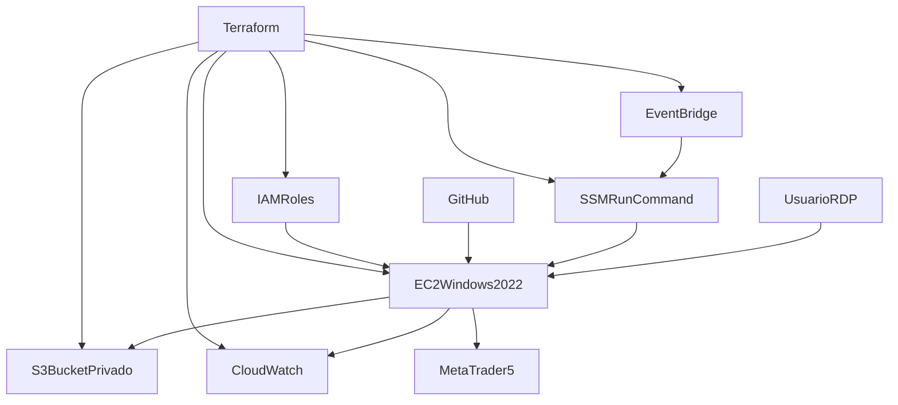

# Memoria tecnica de la capa cloud en AWS

## 1. Objetivo de la capa cloud

La capa cloud del proyecto se ha disenado con un criterio deliberadamente minimalista. El objetivo no ha sido construir una plataforma distribuida de proposito general, sino trasladar el sistema multiagente de trading a un entorno remoto reproducible, manteniendo la compatibilidad con MetaTrader 5 y reduciendo al minimo la complejidad operativa.

La idea central es sencilla:

- mantener el desarrollo principal en local;
- usar GitHub como fuente oficial del codigo;
- desplegar una unica maquina Windows en AWS para ejecutar la aplicacion;
- externalizar datos, artefactos y backups en S3;
- automatizar tareas periodicas con servicios gestionados de AWS;
- conservar trazabilidad y observabilidad suficientes para operar y defender la solucion en la memoria del TFM.

Esta decision queda explicitamente documentada en `infra/terraform/README_TERRAFORM.md`, donde se indica tanto lo que Terraform crea como lo que deliberadamente no crea.

## 2. Alcance real de la solucion cloud

La solucion cloud implementada en el proyecto utiliza una capa minima sobre AWS. Los servicios realmente empleados son:

- `Amazon EC2`, para alojar la aplicacion en una instancia Windows Server 2022.
- `Amazon S3`, para persistencia externa de datos, artefactos, modelos y backups.
- `AWS IAM`, para roles y permisos entre servicios sin credenciales embebidas.
- `AWS Systems Manager (SSM)`, para ejecutar scripts remotos en la instancia.
- `Amazon EventBridge`, para programar tareas periodicas.
- `Amazon CloudWatch`, para grupos de logs y alarmas basicas.
- `SSM Parameter Store` publico de AWS, para resolver la AMI oficial de Windows Server 2022.
- `Terraform`, como herramienta de infraestructura como codigo.

Del mismo modo, tambien es importante dejar claro lo que no forma parte de esta iteracion:

- no se usa `AWS Batch`;
- no se usan `Lambda`, `SNS`, `ECS`, `RDS` o `DynamoDB`;
- no se despliega una VPC personalizada;
- no se automatiza la instalacion de MT5;
- no se crean pipelines CI/CD completos;
- no se gestionan secretos desde Terraform.

Este alcance acotado es una decision tecnica y metodologica. Permite que la arquitectura sea defendible academicamente, mas barata y mucho mas sencilla de operar.

## 3. Arquitectura general

La arquitectura cloud puede resumirse como una integracion entre infraestructura declarativa, una instancia Windows unica y varios servicios auxiliares de persistencia, automatizacion y observabilidad.



La secuencia funcional es la siguiente:

1. Terraform aprovisiona la infraestructura minima.
2. La EC2 Windows ejecuta un `user_data` de bootstrap.
3. La instancia clona el repositorio, prepara `.venv` y deja lista la aplicacion.
4. Streamlit y el runtime se lanzan desde scripts PowerShell.
5. S3 se usa como almacenamiento externo para datos y artefactos.
6. EventBridge programa ejecuciones que llegan a la instancia a traves de SSM Run Command.
7. CloudWatch recoge logs y alarmas basicas del sistema.
8. MT5 se instala manualmente por RDP, fuera del alcance de Terraform.

## 4. Terraform como base reproducible

La decision estructural mas importante es que la infraestructura no se despliega manualmente, sino mediante Terraform en `infra/terraform/`.

Los ficheros principales son:

- `infra/terraform/provider.tf`
- `infra/terraform/main.tf`
- `infra/terraform/variables.tf`
- `infra/terraform/outputs.tf`

### 4.1. Como se ha hecho

Terraform centraliza:

- el proveedor AWS y la region;
- las variables de despliegue;
- las consultas a recursos existentes;
- la creacion de todos los recursos cloud de esta iteracion.

En `main.tf` se observa una eleccion de simplificacion importante:

- se consulta la `default VPC`;
- se consultan sus subredes por defecto;
- se obtiene la AMI oficial de `Windows Server 2022` desde `SSM Parameter Store`.

Esto evita tener que crear y mantener una red completa propia para un despliegue cuyo objetivo principal no es la infraestructura, sino la operativa del sistema multiagente.

### 4.2. Por que se ha elegido

Terraform se elige por tres motivos principales:

1. **Reproducibilidad**. La infraestructura puede recrearse de forma consistente.
2. **Trazabilidad**. Cada recurso y cada cambio quedan expresados en codigo.
3. **Defensa academica**. Permite argumentar que la capa cloud no depende de configuraciones manuales opacas.

Ademas, la propia documentacion `infra/terraform/README_TERRAFORM.md` deja claro el alcance de la solucion, lo que ayuda a justificar por que no se anadieron servicios no esenciales.

## 5. Servicio a servicio: que se usa, como se implementa y por que se eligio

### 5.1. Amazon EC2

#### Que se ha usado

Se ha utilizado una unica instancia `EC2 Windows Server 2022` como servidor operativo del sistema.

#### Como se ha hecho

La definicion principal esta en `infra/terraform/ec2.tf`. Ahi se puede ver que la instancia:

- usa una AMI oficial de Windows resuelta desde `main.tf`;
- recibe IP publica;
- usa un `instance profile` IAM;
- activa `monitoring = true`;
- ejecuta `user_data` mediante la plantilla `infra/terraform/user_data_windows.ps1.tpl`;
- obliga a usar `IMDSv2` con `http_tokens = "required"`;
- monta un disco raiz `gp3`, cifrado, con `delete_on_termination = false`.

#### Por que se ha elegido

La eleccion de EC2 Windows no es arbitraria. Viene determinada por la dependencia de `MetaTrader5`, cuyo terminal y API Python requieren un entorno Windows real. Por tanto:

- Linux no era una opcion natural para la parte de ejecucion MT5;
- una EC2 Windows permitia mantener Streamlit, supervisor, runtime y MT5 en la misma maquina;
- una sola instancia reduce complejidad, coste de coordinacion y esfuerzo de mantenimiento.

La eleccion del disco `gp3` y el cifrado responde a un equilibrio entre rendimiento, coste y seguridad. El hecho de no borrar automaticamente el volumen al destruir la instancia prioriza la persistencia del entorno operativo.

### 5.2. Amazon S3

#### Que se ha usado

Se ha utilizado un bucket S3 privado como almacenamiento externo del proyecto.

#### Como se ha hecho

La configuracion esta en `infra/terraform/s3.tf`. El bucket se crea con:

- bloqueo completo de acceso publico;
- versionado activado;
- cifrado SSE-S3 con `AES256`.

En el plano aplicativo, S3 se usa de dos maneras:

1. **Desde PowerShell y AWS CLI**, mediante scripts como:
   - `scripts/cloud/sync_to_s3.ps1`
   - `scripts/cloud/sync_from_s3.ps1`
   - `scripts/cloud/backup_to_s3.ps1`

2. **Desde Python y boto3**, mediante:
   - `app/cloud/cloud_config.py`
   - `app/cloud/cloud_paths.py`
   - `app/cloud/s3_storage.py`
   - `app/cloud/heartbeat.py`

El prefijo logico de trabajo se centraliza en `TFM_S3_PREFIX`, normalmente `tfm-trading`.

Los datos que se suben o sincronizan incluyen:

- `datos/`
- `app/.tmp/`
- backups SQLite
- modelos PPO
- logs
- reportes

#### Por que se ha elegido

S3 se ha elegido por cuatro razones:

1. **Desacoplar la persistencia del disco local de la EC2**.
2. **Facilitar reconstrucciones de la maquina** sin perder artefactos clave.
3. **Mantener un coste bajo** frente a soluciones mas pesadas.
4. **Aprovechar una API simple y estandar** tanto desde AWS CLI como desde Python.

La activacion del versionado tambien es importante en terminos de resiliencia, porque aporta una red de seguridad adicional frente a sobrescrituras accidentales.

### 5.3. AWS IAM

#### Que se ha usado

Se han usado roles IAM para dos relaciones principales:

- permisos de la EC2 hacia S3, SSM y CloudWatch;
- permisos de EventBridge para ejecutar `SSM Run Command`.

#### Como se ha hecho

La definicion esta en `infra/terraform/iam.tf`.

Para la EC2 se crea:

- un rol asumible por `ec2.amazonaws.com`;
- una politica inline con permisos `s3:ListBucket`, `s3:GetObject` y `s3:PutObject`;
- el adjunto de `AmazonSSMManagedInstanceCore`;
- el adjunto de `CloudWatchAgentServerPolicy`;
- un `aws_iam_instance_profile` asociado a la instancia.

Para EventBridge se crea:

- un rol asumible por `events.amazonaws.com`;
- una politica con permiso `ssm:SendCommand` sobre el documento `AWS-RunPowerShellScript` y sobre la instancia concreta.

#### Por que se ha elegido

IAM se ha elegido para evitar credenciales fijas en codigo, scripts o `.env`. Esto es especialmente importante en un proyecto academico que debe poder enseñarse, versionarse y mantenerse sin exponer secretos.

Ademas, el uso de roles:

- mejora la seguridad;
- simplifica la operacion en la propia EC2;
- sigue el principio de privilegio minimo razonable;
- integra de forma natural EC2, S3, CloudWatch y SSM.

### 5.4. AWS Systems Manager (SSM)

#### Que se ha usado

Se ha usado `Systems Manager` para ejecutar comandos remotos sobre la instancia mediante `Run Command`.

#### Como se ha hecho

El uso de SSM aparece de dos formas:

1. **Indirectamente en Terraform**, como destino de EventBridge mediante el documento administrado `AWS-RunPowerShellScript` en `infra/terraform/eventbridge.tf`.
2. **Operativamente**, gracias a la politica `AmazonSSMManagedInstanceCore` adjunta al rol de la EC2.

SSM se utiliza para lanzar scripts PowerShell directamente dentro de la instancia sin depender de SSH ni de acceso manual permanente por RDP.

#### Por que se ha elegido

SSM permite:

- ejecucion remota controlada;
- menor dependencia de accesos interactivos;
- trazabilidad y centralizacion de tareas automatizadas;
- integracion nativa con EventBridge.

Esto encaja muy bien con una arquitectura de maquina unica que necesita lanzar scripts periodicos sin introducir servicios adicionales.

### 5.5. Amazon EventBridge

#### Que se ha usado

Se han usado reglas programadas para automatizar tareas recurrentes del proyecto.

#### Como se ha hecho

La implementacion esta en:

- `infra/terraform/eventbridge.tf`
- `infra/terraform/locals.tf`

En `locals.tf` se define `scheduled_tasks`, donde se programan:

- `daily_backup`
- `daily_update`
- `weekly_rebalance`
- `monthly_refresh`
- `healthcheck`

En `eventbridge.tf`, cada regla llama a `AWS-RunPowerShellScript` via SSM y ejecuta el script correspondiente en `C:\\tfm\\tfm-project`.

#### Por que se ha elegido

EventBridge se ha elegido porque permite externalizar el scheduler fuera del propio sistema operativo, manteniendo la programacion en la capa AWS. Sus ventajas en este contexto son:

- configuracion declarativa por Terraform;
- integracion sencilla con SSM;
- ausencia de componentes adicionales como Lambda;
- claridad en la documentacion del flujo operativo.

Ademas, la documentacion reconoce un fallback pragmatico: si la integracion EventBridge + SSM da problemas, los mismos scripts pueden reprogramarse en Windows Task Scheduler.

### 5.6. Amazon CloudWatch

#### Que se ha usado

Se han usado dos piezas de CloudWatch:

- `CloudWatch Log Groups`
- `CloudWatch Metric Alarms`

#### Como se ha hecho

La infraestructura se define en `infra/terraform/cloudwatch.tf`, apoyada en `infra/terraform/locals.tf`.

Se crean grupos de logs para:

- runtime
- streamlit
- supervisor
- risk-agent
- portfolio
- bootstrap

Tambien se crean alarmas basicas sobre:

- `StatusCheckFailed`
- `CPUUtilization`
- `LogicalDisk % Free Space`

La integracion del agente se realiza con `scripts/cloud/install_cloudwatch_agent.ps1`, que instala y configura `Amazon CloudWatch Agent` para enviar:

- logs de ficheros locales;
- metricas basicas de Windows, como disco y memoria.

En paralelo, existe un mecanismo complementario de latido en:

- `app/cloud/heartbeat.py`
- `scripts/cloud/healthcheck.ps1`

#### Por que se ha elegido

CloudWatch se ha elegido por ser la opcion nativa y mas simple dentro de AWS para cubrir observabilidad basica. En un TFM, esta solucion resulta suficiente para:

- recoger logs sin montar una pila ELK;
- definir alarmas minimas de salud de la instancia;
- tener una evidencia clara de estado operativo.

No se ha buscado una observabilidad avanzada, sino una base suficientemente robusta y defendible para esta iteracion.

### 5.7. SSM Parameter Store publico

#### Que se ha usado

Se ha utilizado el parametro publico de AWS que expone la AMI mas reciente de `Windows Server 2022`.

#### Como se ha hecho

En `infra/terraform/main.tf` se consulta:

- `/aws/service/ami-windows-latest/Windows_Server-2022-English-Full-Base`

#### Por que se ha elegido

Esto evita fijar manualmente un identificador de AMI, reduce errores y mejora la mantenibilidad del despliegue. Es una forma simple de asegurar que la base del sistema operativo esta alineada con una imagen oficial mantenida por AWS.

## 6. Bootstrap y preparacion de la EC2

Una vez creada la infraestructura, la instancia necesita quedar lista para ejecutar la aplicacion.

### 6.1. Como se ha hecho

El bootstrap se realiza automaticamente mediante `infra/terraform/user_data_windows.ps1.tpl`.

El script:

- instala Chocolatey si no existe;
- instala `git`;
- instala `python` en `C:\\Python311`;
- instala `awscli`;
- crea rutas base bajo `C:\\tfm`;
- define variables de entorno de maquina;
- clona o actualiza el repositorio;
- copia `.env.example` a `.env` si no existe;
- crea `.venv`;
- instala `requirements.txt`.

Existe ademas un script reutilizable para repetir ese proceso manualmente:

- `scripts/cloud/bootstrap_windows_ec2.ps1`

### 6.2. Por que se ha elegido

El `user_data` permite que la maquina salga del aprovisionamiento ya preparada, evitando configuraciones manuales repetitivas. La version PowerShell paralela sirve como mecanismo de recuperacion o reprovisionado cuando se quiera rehacer la instancia sin depender solo del primer arranque.

## 7. Flujo operativo extremo a extremo

El flujo real de trabajo cloud puede describirse como una cadena de pasos.

### Paso 1. Desarrollo local

El desarrollo principal ocurre en local. El repositorio se prueba y evoluciona fuera de AWS.

### Paso 2. Publicacion de codigo

GitHub actua como fuente oficial del codigo. La EC2 clona el repositorio y despues puede actualizarse con `git pull`.

Este flujo se resume tambien en `README_DEPLOYMENT_AWS.md`.

### Paso 3. Aprovisionamiento con Terraform

Desde `infra/terraform` se ejecutan:

```powershell
terraform init
terraform plan
terraform apply
```

Con ello se crea la capa minima de infraestructura.

### Paso 4. Bootstrap de la maquina

La propia instancia, al arrancar, ejecuta el `user_data` y queda preparada para correr el proyecto.

### Paso 5. Ajuste manual de MT5

MT5 no se instala automaticamente. La instalacion se realiza manualmente por RDP, lo cual es coherente con la naturaleza del terminal y con las restricciones de su integracion en Windows.

### Paso 6. Actualizacion del proyecto

Cuando se hace `git push`, la EC2 puede sincronizarse con:

- `scripts/cloud/deploy_update.ps1`

Este script:

- hace `git pull`;
- actualiza dependencias;
- ejecuta `python -m app.cloud_tasks.smoke_test_cloud`.

### Paso 7. Ejecucion de la interfaz

La interfaz se arranca mediante:

- `scripts/cloud/run_streamlit.ps1`

Este script lanza:

- `streamlit run app/ui/dashboard.py`

sobre `0.0.0.0`, con el puerto definido por `STREAMLIT_PORT`, en modo `headless`, y escribiendo transcript local en `app/.tmp/logs/streamlit.log`.

### Paso 8. Ejecucion del runtime

El runtime operativo se lanza mediante:

- `scripts/cloud/run_runtime.ps1`

que ejecuta:

- `python -m app.cloud_tasks.run_runtime`

La finalidad es mantener vivo el supervisor y el ciclo operativo sin depender de que Streamlit sea el unico proceso activo.

### Paso 9. Automatizacion de tareas

Las reglas programadas de EventBridge ejecutan, via SSM:

- `scripts/cloud/run_daily_update.ps1`
- `scripts/cloud/run_weekly_rebalance.ps1`
- `scripts/cloud/run_monthly_refresh.ps1`
- `scripts/cloud/backup_to_s3.ps1`
- `scripts/cloud/healthcheck.ps1`

Se trata de un flujo mixto entre tareas Python del proyecto y wrappers PowerShell que dejan trazabilidad en `app/.tmp/logs`.

### Paso 10. Persistencia y recuperacion

La informacion operativa se guarda en:

- SQLite local;
- `datos/`;
- artefactos bajo `app/.tmp/`.

Posteriormente:

- `backup_to_s3.ps1` sube backups con timestamp del SQLite y sincroniza datos, artefactos y logs;
- `sync_from_s3.ps1` permite reconstruir una instancia recuperando la informacion principal.

## 8. Scripts cloud y funcion de cada uno

Los scripts de `scripts/cloud` tienen una funcion muy clara y conviene mencionarlos en la memoria porque forman el puente entre la infraestructura AWS y la aplicacion.

### 8.1. `deploy_update.ps1`

Sirve para actualizar la instancia despues de cambios de codigo.

### 8.2. `run_streamlit.ps1`

Expone el dashboard de usuario.

### 8.3. `run_runtime.ps1`

Mantiene el runtime y el supervisor.

### 8.4. `run_daily_update.ps1`

Ejecuta la actualizacion diaria y despues lanza backup a S3.

### 8.5. `run_weekly_rebalance.ps1`

Ejecuta el rebalanceo semanal y despues backup.

### 8.6. `run_monthly_refresh.ps1`

Ejecuta el refresco mensual y despues backup.

### 8.7. `backup_to_s3.ps1`

Realiza la copia de seguridad del estado y los artefactos.

### 8.8. `sync_to_s3.ps1` y `sync_from_s3.ps1`

Permiten sincronizar informacion de forma bidireccional entre la instancia y S3.

### 8.9. `healthcheck.ps1`

Genera el `heartbeat` del sistema.

### 8.10. `install_cloudwatch_agent.ps1`

Instala y configura el agente de CloudWatch.

## 9. Coste de la solucion y justificacion de simplicidad

Desde el punto de vista economico, la arquitectura se ha contenido intencionadamente.

Los costes principales provienen de:

- una unica `EC2 Windows`, que es mas costosa que Linux pero necesaria por MT5;
- almacenamiento `EBS`;
- almacenamiento `S3`, incrementado por el versionado;
- logs y metricas de `CloudWatch`.

No se han incorporado servicios adicionales como:

- bases de datos gestionadas;
- colas;
- contenedores;
- pipelines CI/CD completos;
- servicios serverless intermedios.

La razon de esta decision es doble:

1. el TFM necesitaba una solucion funcional, no una plataforma sobredimensionada;
2. cada servicio adicional habria aumentado el coste, la complejidad y el esfuerzo de justificacion academica.

En consecuencia, la arquitectura responde al principio de **minima complejidad suficiente**.

## 10. Seguridad de la solucion

La seguridad se aborda con medidas basicas pero coherentes con el alcance del proyecto.

### 10.1. Red

El `Security Group` restringe:

- RDP a un CIDR concreto;
- Streamlit a un CIDR concreto.

No se recomienda abrir estos puertos a `0.0.0.0/0`.

### 10.2. Identidad y permisos

La EC2 usa `IAM Role`, lo que evita almacenar access keys dentro de la maquina o del repositorio.

### 10.3. Almacenamiento

S3 se configura como bucket privado, con cifrado y bloqueo de acceso publico.

### 10.4. Metadatos de instancia

La instancia exige `IMDSv2`, lo que mejora la proteccion frente a accesos no deseados a metadatos.

### 10.5. Codigo y configuracion sensible

La documentacion deja claro que no deben versionarse:

- `.env`
- `terraform.tfvars`
- `terraform.tfstate`
- bases SQLite
- datos
- artefactos operativos

## 11. Limitaciones tecnicas y lecciones aprendidas

Este punto es especialmente importante para la memoria porque explica por que la arquitectura adopta esta forma y no otra.

### 11.1. Dependencia estructural de MT5

La mayor restriccion del despliegue cloud es `MetaTrader5`. El terminal y su API obligan a trabajar en Windows y a mantener una logica de instalacion manual por RDP.

Esto condiciona:

- la eleccion de EC2 Windows;
- la necesidad de acceso remoto interactivo;
- la dificultad de una automatizacion 100 % desacoplada.

### 11.2. Arquitectura monoinstancia

Se ha optado por una sola instancia. Esto simplifica el sistema, pero tambien implica:

- menor tolerancia a fallos;
- escalabilidad horizontal limitada;
- dependencia del estado local de la maquina.

### 11.3. Automatizacion suficiente, no total

Terraform automatiza la infraestructura y `user_data` automatiza la preparacion basica, pero no toda la capa operativa puede automatizarse por completo debido a MT5.

### 11.4. Observabilidad basica

La observabilidad es suficiente para este alcance, pero no equivalente a la de un entorno enterprise. Se prioriza visibilidad minima viable frente a una pila de monitorizacion avanzada.

## 12. Justificacion final de la arquitectura elegida

La eleccion de `EC2 Windows + S3 + IAM + SSM/EventBridge + CloudWatch + Terraform` no responde a una busqueda de sofisticacion, sino a una optimizacion entre compatibilidad tecnica, esfuerzo de implementacion y claridad academica.

La arquitectura final puede justificarse asi:

- `EC2 Windows` era necesaria por MT5;
- `S3` era la forma mas simple y barata de externalizar persistencia;
- `IAM` permitia operar sin credenciales embebidas;
- `SSM + EventBridge` resolvian la automatizacion periodica sin meter mas servicios;
- `CloudWatch` cubria la observabilidad minima;
- `Terraform` convertia toda la capa cloud en una infraestructura reproducible y defendible.

Por tanto, la solucion no pretende ser la arquitectura mas escalable posible, sino la mas coherente con el problema real del TFM.

## 13. Resumen ejecutivo para cerrar la memoria

Como cierre de la seccion cloud, puede resumirse la implementacion de la siguiente forma:

> La capa cloud del proyecto se ha construido como una infraestructura minima y reproducible sobre AWS. Terraform aprovisiona una EC2 Windows, un bucket S3 privado, roles IAM, log groups y reglas programadas con EventBridge y SSM. La EC2 ejecuta la aplicacion, almacena su estado local en SQLite y sincroniza datos, artefactos y backups con S3. CloudWatch aporta observabilidad basica y MetaTrader 5 se instala manualmente por RDP, al ser la principal restriccion tecnica del sistema. Esta arquitectura fue elegida por simplicidad, compatibilidad con MT5, coste contenido y facilidad de defensa academica.
