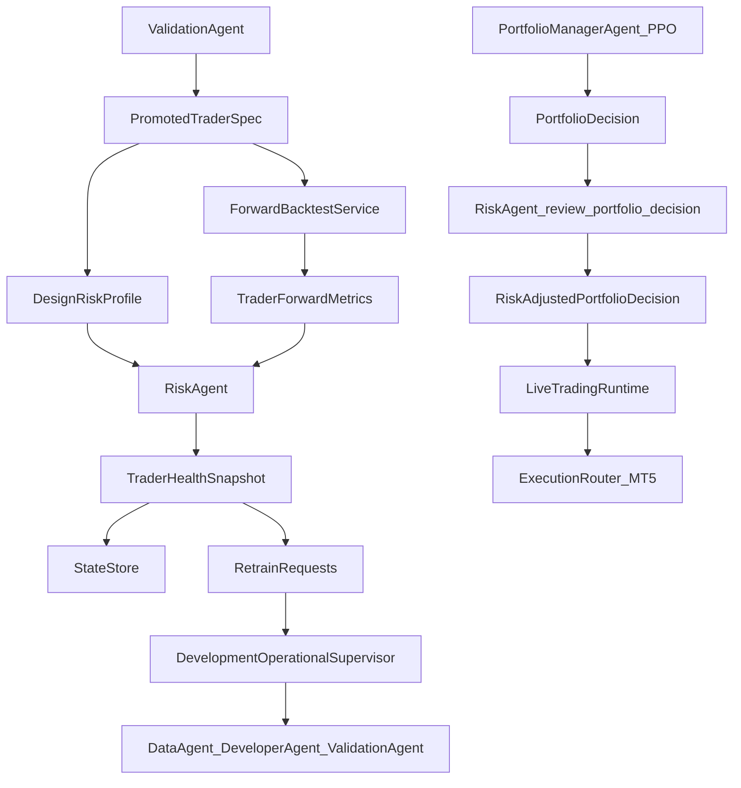
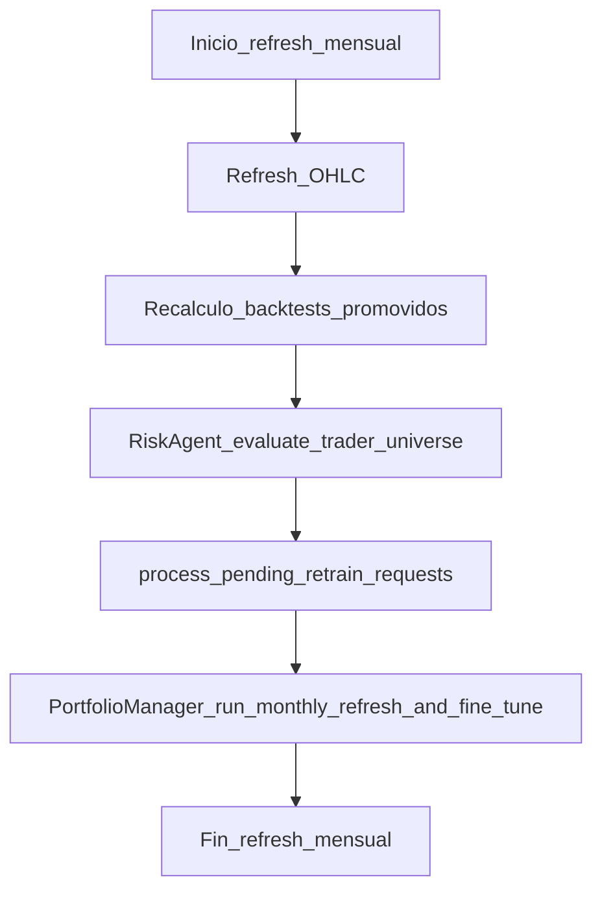

# Desarrollo técnico del `RiskAgent`

## 1. Introducción y propósito

El `RiskAgent` se ha desarrollado para cubrir una carencia estructural del sistema multiagente original: la arquitectura disponía de generación de traders, validación, activación operativa, gestión de cartera mediante PPO y ejecución en MT5, pero no contaba con un bloque especializado que gobernara de forma explícita el riesgo post-promoción ni el riesgo pre-ejecución de la cartera.

La función del `RiskAgent` se divide en dos planos complementarios:

1. **Supervisión de la salud de los traders promovidos**. Una vez que un trader ha sido promovido y activado, deja de ser suficiente asumir que su rendimiento esperado seguirá siendo válido indefinidamente. El agente introduce una evaluación sistemática de la degradación del trader comparando su comportamiento forward post-promoción con un perfil de diseño derivado del backtest que justificó su promoción.
2. **Control de riesgo previo a la ejecución de la cartera**. El hecho de que el `PortfolioManagerAgent` seleccione señales y asigne pesos no implica que la cartera deba ejecutarse sin filtros adicionales. El `RiskAgent` revisa la decisión del PPO antes del envío de órdenes, aplicando restricciones sobre estados de los traders, exposición, concentración, buffer de caja, drawdown de cuenta y margen.

La hipótesis de diseño subyacente es que un sistema de cartera con PPO puede mejorar la asignación dinámica de capital, pero sigue necesitando una capa interpretable, auditable y conservadora que actúe como barrera final de control. Por ello, el `RiskAgent` no se ha implementado como un segundo modelo de aprendizaje, sino como un módulo determinista basado en reglas cuantitativas, métricas rolling y umbrales trazables.

## 2. Problema que resuelve dentro del TFM

Antes de esta implementación, el proyecto disponía de mecanismos para:

- generar traders automáticamente,
- validarlos con criterios cuantitativos,
- promoverlos a operativa,
- agregar señales simultáneas mediante un `PortfolioManagerAgent`,
- ejecutar órdenes en un runtime conectado a MT5.

Sin embargo, faltaban dos capacidades críticas:

- **detectar si un trader promovido había dejado de comportarse como indicaba su evidencia histórica**, y
- **evitar que una decisión PPO válida desde el punto de vista de asignación se tradujera directamente en una cartera operativamente no aceptable**.

En otras palabras, el sistema podía decidir *qué traders son elegibles* y *qué pesos asignar*, pero no tenía una capa explícita que decidiera *si esos traders siguen siendo sanos* ni *si esa cartera concreta es ejecutable bajo criterios de riesgo*.

El `RiskAgent` resuelve esta carencia mediante una combinación de:

- persistencia específica de riesgo,
- backtest forward post-promoción reutilizando el motor ya existente,
- scoring interpretable de salud,
- transición explícita del ciclo de vida del trader,
- emisión de `RetrainRequest`,
- revisión pre-trade de la cartera propuesta por PPO,
- observabilidad completa en SQLite y dashboard.

## 3. Principios de diseño

La implementación se ha guiado por varios principios metodológicos:

### 3.1. Interpretabilidad

La lógica del agente debía ser defendible en una memoria técnica y auditable en producción. Por ello:

- las decisiones se basan en métricas conocidas en gestión cuantitativa,
- el `health_score` parte de 100 y se degrada por penalizaciones explícitas,
- los motivos de cada decisión se almacenan como texto legible,
- los límites de cartera se modelan mediante restricciones comprensibles.

### 3.2. Reutilización de infraestructura existente

No se crea un motor paralelo de simulación. El `RiskAgent` reutiliza el backtest de eventos ya presente en `app/toolbox/backtest_eventos/runner.py`, lo que evita duplicidades metodológicas y reduce el riesgo de inconsistencias entre el entorno de validación y el de supervisión forward.

### 3.3. Trazabilidad persistente

Toda decisión importante genera persistencia en SQLite:

- perfil de diseño,
- run de evaluación de riesgo,
- métricas forward,
- detalle por trader,
- solicitudes de retraining,
- auditoría de señales,
- revisiones de cartera PPO.

Esto permite reconstruir a posteriori qué ocurrió, por qué ocurrió y con qué evidencia.

### 3.4. Separación de planos `shadow` y `executed`

Uno de los aspectos más importantes del diseño es distinguir dos realidades del mismo trader:

- **`shadow`**: representa cómo siguen funcionando sus reglas fijas cuando se simulan en el periodo post-promoción.
- **`executed`**: representa qué parte de ese comportamiento llega realmente a materializarse tras pasar por PPO, Risk y ejecución.

Esta separación es conceptualmente importante en una memoria, porque evita atribuir al trader comportamientos que en realidad dependen del gestor de cartera o del filtro de riesgo.

## 4. Contexto arquitectónico

El `RiskAgent` se inserta en dos puntos de la arquitectura: supervisión periódica y control pre-ejecución.

La integración real afecta principalmente a:

- `app/agents/risk_agent.py`
- `app/services/risk/`
- `app/storage/state_store.py`
- `app/runtime/development_operational_supervisor.py`
- `app/runtime/live_trading_runtime.py`
- `app/ui/dashboard.py`
- `app/ui/dashboard_data.py`

## 5. Contratos y modelos de datos

La ampliación de contratos se ha realizado en `app/contracts/enums.py`, `app/contracts/models.py` y `app/contracts/__init__.py`.

### 5.1. Enum `RiskAction`

`RiskAction` centraliza el vocabulario operativo de riesgo. Se han introducido acciones de dos tipos:

#### Acciones de salud del trader

- `keep`
- `degraded`
- `suspend`
- `retire`
- `retraining`

#### Acciones de revisión de cartera

- `approve`
- `approve_with_clipping`
- `scale_down`
- `force_cash`
- `reject_portfolio`
- `emergency_stop`

Esta separación permite documentar con claridad que el mismo agente gobierna dos dominios relacionados pero no idénticos: el ciclo de vida del trader y la aceptabilidad de la cartera.

### 5.2. `DesignRiskProfile`

`DesignRiskProfile` es el contrato que representa el baseline cuantitativo del trader en el momento de su promoción. Contiene, entre otros campos:

- identificadores del trader,
- fechas de promoción y ventanas temporales de diseño,
- Sharpe, profit factor y drawdown de diseño,
- pérdida media, ganancia media, win rate, expectancy,
- número de trades y frecuencia mensual,
- racha máxima de pérdidas,
- metadatos de trazabilidad.

Su papel metodológico es fundamental: el trader no se evalúa contra umbrales absolutos arbitrarios, sino contra un perfil derivado de la evidencia que justificó su existencia.

### 5.3. `TraderForwardMetrics`

`TraderForwardMetrics` recoge el comportamiento del trader en el periodo post-promoción. El contrato distingue:

- métricas **shadow**: `shadow_trades`, `shadow_pnl`, `shadow_return`, `shadow_sharpe`, `shadow_profit_factor`, `shadow_max_drawdown`, `shadow_avg_loss`, `shadow_avg_win`, `shadow_winrate`, `shadow_expectancy`, `shadow_losing_streak`,
- métricas **executed**: `executed_trades`, `executed_pnl`, `executed_return`, `executed_sharpe`, `executed_profit_factor`, `executed_max_drawdown`,
- métricas de interacción con cartera y riesgo: `signal_count`, `ppo_selected_count`, `ppo_blocked_count`, `risk_blocked_count`,
- flag `insufficient_evidence`.

Esto convierte la evaluación de salud en una tarea mucho más informativa que una simple comprobación de drawdown o Sharpe rolling.

### 5.4. `RiskLimitsConfig`

`RiskLimitsConfig` agrupa la parametrización cuantitativa del agente. Tras la simplificación a un ciclo de vida binario (`LIVE` / `RETRAINING`), sus parámetros más relevantes son:

- `min_forward_trades_for_retraining`: mínimo de trades forward para que la decisión sea vinculante; por debajo se mantiene LIVE,
- `retraining_health_threshold`: umbral del `health_score` por debajo del cual el trader se manda a RETRAINING,
- `max_drawdown_multiplier_retraining`: factor máximo permitido entre drawdown forward y drawdown de diseño,
- `min_profit_factor_ratio_retraining`: ratio mínimo permitido entre profit factor forward y profit factor de diseño,
- `min_sharpe_ratio_retraining`: ratio mínimo permitido entre sharpe forward y sharpe de diseño,
- `max_losing_streak_multiplier`: factor máximo permitido en racha de pérdidas frente a la de diseño,
- `max_weight_per_trader`, `max_weight_per_asset`, `max_total_exposure`: límites de cartera,
- `min_cash_buffer`: buffer mínimo de caja,
- `min_broker_margin_level` y `emergency_drawdown_stop` (opcionales).

Ya no existen umbrales separados para `DEGRADED` o `SUSPENDED`: el modelo es binario, cualquier dimensión por debajo del umbral colapsa al trader a `RETRAINING` (cash). El uso de un contrato explícito de límites simplifica la experimentación, la trazabilidad y la defensa académica del modelo.

### 5.5. `TraderHealthSnapshot`

Este contrato es el resultado principal de una evaluación de riesgo por trader. Incluye:

- estado anterior y nuevo,
- `health_score`,
- acción aplicada,
- motivos explicativos,
- perfil de diseño y métricas forward asociadas,
- flags intermedios,
- `RetrainRequest` opcional,
- metadatos de evaluación.

### 5.6. `RiskAdjustedPortfolioDecision`

Representa la decisión de cartera una vez pasada por el filtro de riesgo. Contiene:

- decisión PPO original,
- pesos originales y ajustados,
- aprobación o rechazo,
- acción aplicada,
- `forced_cash_weight`,
- traders bloqueados,
- traders recortados,
- razones y diagnósticos.

Este contrato es el vínculo formal entre el `PortfolioManagerAgent` y el runtime una vez introducida la capa de riesgo.

## 6. Persistencia y trazabilidad

La persistencia se amplía en `app/storage/state_store.py` con ocho tablas nuevas:

### 6.1. `trader_design_profiles`

Persiste el perfil de diseño de cada trader. Su finalidad es evitar recalcular continuamente el baseline y disponer de una referencia estable y auditable.

### 6.2. `risk_evaluation_runs`

Registra cada evaluación global del universo de traders:

- `run_id`,
- tipo de run,
- estado,
- fechas,
- número de traders evaluados,
- conteo de `degraded`, `suspended`, `retired`,
- número de `retrain_requests`,
- notas y metadatos.

### 6.3. `trader_forward_backtest_runs`

Guarda la ejecución forward por trader:

- periodo forward,
- artefactos generados,
- métricas asociadas,
- estado del run.

### 6.4. `trader_forward_metrics`

Guarda las métricas forward serializadas por evaluación y trader, facilitando consultas y visualización posterior.

### 6.5. `risk_evaluation_details`

Persiste el detalle por trader de cada evaluación:

- estado anterior,
- estado nuevo,
- acción,
- `health_score`,
- razones,
- flags,
- retrain request serializada.

### 6.6. `retrain_requests`

Modela la cola de reentrenamiento desacoplada entre `RiskAgent` y supervisor. Incluye:

- `pending`,
- `running`,
- `completed`,
- `failed`,

y permite que el supervisor procese solicitudes sin acoplar el agente directamente a `DataAgent` o `DeveloperAgent`.

### 6.7. `risk_portfolio_checks`

Registra cada revisión pre-trade de la cartera PPO, incluyendo pesos originales, pesos ajustados, bloqueos, clipping y diagnósticos.

### 6.8. `trader_signal_audit`

Tabla de auditoría fina del plano operativo. Guarda, por señal:

- si la señal estaba activa,
- si PPO la seleccionó,
- peso PPO,
- si Risk la aprobó,
- si finalmente se ejecutó,
- motivo si fue bloqueada,
- metadatos operativos.

### 6.9. Justificación de SQLite + JSON

La estrategia elegida mantiene la filosofía del proyecto:

- columnas escalares para los campos más relevantes,
- estructuras complejas serializadas como JSON.

Esto ofrece tres ventajas:

1. mantiene compatibilidad con el patrón existente del store,
2. evita una explosión de tablas excesivamente normalizadas,
3. conserva auditabilidad y facilidad de inspección manual.

## 7. Construcción del perfil de diseño

La construcción del baseline se implementa en `app/services/risk/forward_backtest_service.py` mediante `build_design_risk_profile(...)`.

### 7.1. Entrada de información

La función recibe:

- el `PromotedTraderSpec`,
- un posible `validation_report`,
- el resumen de backtest,
- los artefactos del backtest histórico.

### 7.2. Método de construcción

El proceso es:

1. leer artefactos históricos (`historical_pnl_path`, `historical_trades_path`) si existen,
2. normalizar curvas de equity/balance,
3. normalizar trades,
4. calcular métricas cuantitativas sobre la evidencia histórica,
5. fusionarlas con estadísticas ya resumidas en `trade_stats`,
6. construir un `DesignRiskProfile` persistible.

### 7.3. Manejo de datos incompletos

Si algunos campos no pueden derivarse, la función no falla de forma rígida. En su lugar:

- registra esa ausencia en `metadata["missing_fields"]`,
- mantiene trazabilidad del origen de artefactos,
- permite que el sistema siga operando.

### 7.4. Persistencia del baseline

La persistencia se realiza por dos vías:

- cuando el `RiskAgent` necesita el perfil y no existe, lo reconstruye y lo persiste,
- como fallback robusto, el supervisor intenta construirlo al completar un backtest promovido en `_run_backtest_for_promoted(...)`.

Esta segunda vía es importante porque asegura que el baseline quede disponible incluso antes de la primera evaluación explícita del `RiskAgent`.

## 8. Servicios cuantitativos de riesgo

La carpeta `app/services/risk/` contiene los servicios especializados del agente.

### 8.1. `risk_metrics.py`

Este módulo define utilidades cuantitativas reutilizables:

- `compute_sharpe`
- `compute_profit_factor`
- `compute_max_drawdown`
- `compute_winrate`
- `compute_avg_win`
- `compute_avg_loss`
- `compute_expectancy`
- `compute_losing_streak`
- `compute_trade_frequency`
- `align_development_and_forward_curves`
- `build_metric_comparison_table`

La lógica está diseñada para aceptar distintos formatos de entrada y normalizarlos internamente. Esto reduce acoplamiento entre servicios y permite reutilizar funciones tanto en scoring como en visualización.

### 8.2. `forward_backtest_service.py`

Este módulo implementa dos piezas esenciales:

1. construcción del baseline (`build_design_risk_profile`),
2. ejecución forward post-promoción (`ForwardBacktestService`).

#### 8.2.1. Backtest forward

`run_forward_backtest_for_trader(...)`:

- localiza el CSV del activo,
- delimita la ventana forward desde `promoted_at` hasta la fecha de evaluación,
- reutiliza `run_event_backtest(...)`,
- genera artefactos propios de forward,
- calcula métricas shadow,
- consulta la auditoría de señales para estimar el plano executed,
- persiste runs y métricas.

#### 8.2.2. Criterio de evidencia insuficiente

Si el tramo post-promoción no dispone de historia suficiente, el servicio devuelve un objeto `TraderForwardMetrics` con `insufficient_evidence=True`, evitando sobrerreaccionar con decisiones duras.

Este comportamiento es metodológicamente razonable: un trader recién promovido no debe ser retirado de inmediato sin tamaño muestral suficiente.

### 8.3. `health_scoring.py`

Contiene la función central `evaluate_trader_health(...)`, donde se traduce el comportamiento cuantitativo del trader a una decisión de ciclo de vida.

## 9. Lógica de scoring de salud

La evaluación de salud se basa en un `health_score` inicial de 100 puntos y un conjunto de penalizaciones explícitas.

### 9.1. Penalizaciones principales

Las penalizaciones consideran:

- evidencia insuficiente,
- deterioro del profit factor respecto al baseline,
- deterioro del Sharpe respecto al baseline,
- drawdown forward comparado con el drawdown de diseño,
- pérdida media peor que la esperada,
- racha de pérdidas superior a la histórica,
- expectancy negativa,
- win rate muy inferior,
- ausencia de edge operativo capturado por PPO,
- señales bloqueadas aguas abajo.

### 9.2. Comparación relativa frente al diseño

Un rasgo importante es que el scoring no utiliza únicamente niveles absolutos. Las funciones comparan el comportamiento forward con:

- `profit_factor_design`,
- `sharpe_design`,
- `max_drawdown_design`,
- `avg_loss_design`,
- `max_losing_streak_design`,
- `winrate_design`.

Esto hace que la evaluación sea relativa a la naturaleza del trader y no a un único patrón universal.

### 9.3. Gestión de evidencia insuficiente

Si el número de trades shadow es menor que `min_forward_trades_for_retraining`, se marca `insufficient_evidence`. En esta situación:

- el trader se mantiene en `LIVE` (`KEEP`),
- no se emite `RetrainRequest`,
- se evita una decisión dura sin soporte estadístico.

### 9.4. Transición entre estados (modelo binario)

Con evidencia suficiente:

1. `KEEP` (estado `LIVE`) si el `health_score` queda por encima de `retraining_health_threshold` y ninguna dimensión rompe sus umbrales.
2. `RETRAINING` (estado `RETRAINING`, peso 0 forzado a caja) si cualquiera de las siguientes se cumple:
   - el `health_score` cae por debajo de `retraining_health_threshold`,
   - el drawdown forward supera el multiplicador admitido respecto al de diseño,
   - el ratio de profit factor o Sharpe cae por debajo de su umbral,
   - se acumulan suficientes penalizaciones por avg loss, racha de pérdidas, expectancy negativa, etc.

Con evidencia insuficiente, siempre `KEEP`: no se manda a reentrenamiento sin datos.

### 9.5. Generación de `RetrainRequest`

Cuando la acción es `RETRAINING`, la función crea un `RetrainRequest` con:

- trader,
- activo,
- timeframe,
- razón compuesta,
- `requested_by=AgentKind.RISK`,
- contexto de evaluación.

Este objeto es luego persistido y consumido por el supervisor.

## 10. Lógica principal del `RiskAgent`

El núcleo se encuentra en `app/agents/risk_agent.py`.

### 10.1. Inicialización

El agente recibe:

- `AgentContext`,
- opcionalmente `RiskThresholds` heredado del diseño mínimo previo,
- opcionalmente `RiskLimitsConfig`,
- opcionalmente una fuente de datos.

Si se proporcionan `RiskThresholds`, estos se integran dentro de `RiskLimitsConfig`, manteniendo compatibilidad hacia atrás con el comportamiento anterior del agente.

### 10.2. Reconstrucción del universo promovido

`_load_promoted_specs()` reconstruye el universo de traders a partir de eventos `TRADER_PROMOTED` guardados en el store. Esta decisión es importante porque evita depender exclusivamente de un registro en memoria.

### 10.3. Obtención del perfil de diseño

`_build_design_profile(...)`:

- intenta leer el perfil persistido,
- si no existe, lo reconstruye a partir del último backtest promovido,
- lo persiste para futuras evaluaciones.

### 10.4. Evaluación individual

`evaluate_single_trader(...)`:

1. localiza el trader en el universo promovido,
2. obtiene el estado actual,
3. obtiene o construye el perfil de diseño,
4. ejecuta el forward backtest,
5. llama a `evaluate_trader_health(...)`,
6. persiste el snapshot,
7. actualiza estado y eventos,
8. emite logging estructurado.

### 10.5. Evaluación del universo completo

`evaluate_trader_universe(...)`:

- crea un `risk_evaluation_run`,
- recorre todos los traders promovidos,
- evalúa uno a uno,
- agrega conteos por acción,
- cierra el run como `completed` o `failed`.

### 10.6. Programación temporal

`should_run_monthly_evaluation(...)` devuelve `True` si:

- se fuerza la evaluación, o
- no existen runs previos, o
- la fecha está en los tres primeros días del mes, o
- han pasado al menos 30 días desde la última evaluación.

Esto introduce una lógica temporal más flexible que un mero calendario rígido mensual.

### 10.7. Evaluación forzada

`force_risk_evaluation(...)` encapsula el caso de evaluación manual, permitiendo además forzar el recomputo forward.

## 11. Integración con el supervisor

La integración principal se realiza en `app/runtime/development_operational_supervisor.py`.

### 11.1. Instanciación

El supervisor crea `self.risk_agent = RiskAgent(...)` durante `_setup_context()`, igual que hace con el resto de agentes.

### 11.2. Pipeline mensual real

El flujo mensual implementado es:

Este orden es metodológicamente coherente:

1. primero se actualiza la materia prima,
2. después se recalculan los traders promovidos,
3. a continuación se juzga su salud,
4. luego se procesan las consecuencias de ese juicio,
5. y finalmente se reentrena la cartera sobre el universo resultante.

### 11.3. Métodos públicos nuevos

El supervisor expone:

- `run_risk_monthly_evaluation()`
- `force_risk_evaluation()`
- `get_risk_agent_snapshot()`
- `get_retrain_requests_snapshot()`
- `process_pending_retrain_requests()`

### 11.4. Cola de retraining desacoplada

Una decisión de diseño importante es que el `RiskAgent` no invoca directamente a `DataAgent`, `DeveloperAgent` o `ValidationAgent`. En su lugar:

- emite una `RetrainRequest`,
- la persiste,
- el supervisor la consume posteriormente.

Esto reduce el acoplamiento entre responsabilidades y mantiene al `RiskAgent` como evaluador y no como orquestador de desarrollo.

### 11.5. Procesamiento de `RetrainRequest`

`process_pending_retrain_requests()`:

- marca la request como `running`,
- prepara dataset,
- vuelve a desarrollar,
- vuelve a validar,
- activa el trader promovido resultante,
- ejecuta backtest,
- actualiza runtime si es necesario,
- marca la request como `completed` o `failed`,
- persiste `RETRAIN_PROCESSED`.

## 12. Integración pre-trade con el runtime

La integración pre-trade se implementa en `app/runtime/live_trading_runtime.py`.

### 12.1. Punto exacto de inserción

Una vez que el `PortfolioManagerAgent` produce `pm_out`, el runtime:

1. reconstruye un `PortfolioDecision`,
2. llama a `risk_agent.review_portfolio_decision(...)`,
3. sustituye pesos y seleccionados por la versión ajustada,
4. actualiza `pm_out` con `risk_adjusted_decision`,
5. solo entonces continúa hacia el envío de órdenes.

### 12.2. Reglas aplicadas por `review_portfolio_decision(...)`

La revisión de cartera opera en varias capas:

#### Estado del trader

- aprueba peso si está en `LIVE`,
- fuerza peso 0 (cash) si está en `RETRAINING`.

#### Restricciones nominales

- límite máximo por trader,
- límite agregado por activo,
- límite de exposición total,
- buffer mínimo de caja.

#### Restricciones de cuenta

- margen mínimo opcional,
- `EMERGENCY_STOP` si el drawdown de cuenta supera el umbral configurado.

### 12.3. Posibles salidas

La cartera puede resultar:

- aprobada sin cambios,
- aprobada con clipping,
- reducida globalmente,
- forzada a caja,
- rechazada,
- detenida por emergencia.

### 12.4. Auditoría de señales

Incluso cuando una señal no termina en orden, el runtime llama a `_audit_signal(...)` y persiste la trazabilidad en `trader_signal_audit`. Esto es importante porque permite estudiar ex post:

- qué señales generó el trader,
- cuáles seleccionó PPO,
- cuáles vetó Risk,
- cuáles llegaron a ejecutarse realmente.

### 12.5. Resiliencia ante fallos del gate

Si la revisión Risk lanza una excepción, el runtime registra `risk_agent_review_error` y continúa sin ajuste Risk. Esta decisión debe documentarse como una decisión de resiliencia operativa, pero también como una limitación de seguridad que podría refinarse en trabajo futuro.

## 13. Persistencia específica de la interacción pre-trade

La revisión de cartera y la auditoría operativa generan dos trazas distintas:

- `risk_portfolio_checks`: revisión agregada de la cartera,
- `trader_signal_audit`: auditoría por señal individual.

Desde el punto de vista metodológico, esta separación es útil porque permite estudiar tanto:

- la política de aprobación de carteras,
- como la microdinámica de decisiones a nivel de trader.

## 14. Visualización y observabilidad

El dashboard amplía la observabilidad del sistema con una pestaña específica `Risk Agent`.

### 14.1. Snapshot de supervisor

`get_risk_agent_snapshot()` construye una vista agregada a partir de:

- runs de evaluación,
- detalles por trader,
- perfiles de diseño,
- métricas forward,
- runs forward,
- checks de cartera,
- retrain requests.

### 14.2. KPIs principales

La pestaña muestra:

- fecha de última evaluación,
- estado del último run,
- número de traders en `LIVE` y en `RETRAINING`,
- retrain requests pendientes,
- traders con evidencia insuficiente.

### 14.3. Resumen por trader

Para cada trader se expone:

- estado actual,
- score de salud,
- acción más reciente,
- número de trades shadow y ejecutados,
- contadores de bloqueos PPO y Risk,
- métricas comparativas frente al diseño.

### 14.4. Visualización de curvas

La pestaña usa `align_development_and_forward_curves(...)` para mostrar:

- curva de desarrollo,
- curva forward,
- marcador temporal de promoción,
- drawdown comparado.

Desde el punto de vista de memoria, esto es especialmente valioso porque permite ilustrar visualmente la hipótesis central del agente: que la calidad del trader debe comprobarse tras su promoción y no solo antes de ella.

### 14.5. Historial de decisiones y checks de cartera

También se muestran:

- historial de decisiones Risk por trader,
- últimos `portfolio risk checks`,
- pesos originales y ajustados,
- motivos de bloqueo o clipping.

## 15. Validación mediante tests

La implementación se ha acompañado de una batería de tests específicos.

### 15.1. `test_design_risk_profile_serialization.py`

Valida que `DesignRiskProfile`:

- se serializa correctamente,
- se persiste en el store,
- se reconstruye sin pérdida de información.

### 15.2. `test_risk_health_scoring.py`

Valida el comportamiento del scoring en escenarios representativos:

- trader sano,
- evidencia insuficiente,
- degradación moderada,
- suspensión,
- retirada con generación de `RetrainRequest`.

Este bloque de tests es especialmente importante porque demuestra que el `health_score` no es una heurística arbitraria no validada, sino una lógica cuantitativa sometida a casos de prueba explícitos.

### 15.3. `test_risk_portfolio_gate.py`

Comprueba la lógica de `review_portfolio_decision(...)`:

- aprobación limpia,
- bloqueo de traders suspendidos,
- reducción de traders degradados,
- clipping por peso máximo,
- reducción por exposición total y buffer de caja.

### 15.4. `test_state_store_risk_tables.py`

Valida que las nuevas tablas del store admiten roundtrip correcto para:

- runs de evaluación,
- detalles de evaluación,
- retrain requests.

### 15.5. `test_live_runtime_risk_integration.py`

Comprueba que el runtime respeta la decisión de Risk y no envía órdenes de traders bloqueados.

### 15.6. `test_risk_agent_force_evaluation.py`

Valida:

- que `force_risk_evaluation()` persiste snapshots y runs,
- que el supervisor actualiza correctamente su estado interno al forzar una evaluación.

### 15.7. Alcance de la validación

La cobertura es sólida a nivel:

- unitario,
- de store,
- de scoring,
- de gate,
- de integración acotada con runtime y supervisor.

No obstante, sigue siendo razonable reconocer que no existe una prueba end-to-end completa de toda la cadena mensual con mercado real y MT5 operativo.

## 16. Decisiones de diseño relevantes

### 16.1. Coexistencia con `assess_trader(...)`

El archivo `risk_agent.py` conserva un método legado `assess_trader(...)` basado en `trader_metrics_latest`. Aunque el camino principal del nuevo diseño es `evaluate_trader_health(...)` con forward backtest, la coexistencia de ambos caminos debe documentarse explícitamente.

Esto puede interpretarse de dos formas:

- como compatibilidad hacia atrás,
- o como deuda técnica pendiente de consolidación.

### 16.2. Uso de eventos `TRADER_PROMOTED` como fuente del universo

El `RiskAgent` reconstruye su universo a partir de eventos persistidos. Esta decisión favorece persistencia y robustez, aunque también implica que la integridad del pipeline depende de la correcta emisión de dichos eventos.

### 16.3. Parámetros de riesgo configurables

El uso de `RiskLimitsConfig` permite que el diseño no quede atado a un conjunto fijo de umbrales, lo que facilita:

- calibración experimental,
- análisis de sensibilidad,
- adaptación futura a otros mercados o frecuencias.

### 16.4. Filtro pre-trade separado del scoring

La salud del trader y la aceptabilidad de la cartera se modelan por separado. Esto es conceptualmente correcto: un trader sano puede aparecer en una cartera no aceptable, y un trader degradado puede seguir siendo elegible con una reducción de peso.

## 17. Limitaciones actuales

Aunque el `RiskAgent` queda plenamente funcional, existen limitaciones relevantes que conviene documentar:

1. La lógica `executed` depende de la calidad de la auditoría operativa disponible.
2. `open_positions` está declarado en el gate pero aún no participa en reglas más sofisticadas.
3. Si falla la revisión Risk en runtime, el sistema sigue adelante con la decisión PPO sin ajuste.
4. El calendario de evaluación Risk y el calendario mensual del portfolio manager no son exactamente idénticos.
5. El método legado `assess_trader(...)` convive con el pipeline principal y puede generar ambigüedad conceptual si no se explica bien.

## 18. Líneas futuras de trabajo

A partir de esta implementación, existen extensiones razonables:

- incorporar reglas dependientes de posiciones abiertas reales,
- refinar el uso del plano `executed`,
- introducir backtests de integración supervisor-Risk-runtime más completos,
- consolidar o retirar el método legado `assess_trader(...)`,
- ampliar la modelización de riesgo a nivel sectorial o de correlación,
- estudiar calibraciones formales de `RiskLimitsConfig`.

## 19. Contribución metodológica al TFM

Desde la perspectiva de la memoria, el `RiskAgent` aporta una contribución metodológica clara: transforma una arquitectura multiagente centrada en generación, validación y asignación de cartera en un sistema gobernado además por una capa explícita de supervisión y control de riesgo.

Esta contribución no consiste en añadir complejidad algorítmica por sí misma, sino en introducir una disciplina de control que:

- compara el comportamiento post-promoción con la evidencia de diseño,
- formaliza transiciones del ciclo de vida del trader,
- desacopla la solicitud de retraining de su procesamiento,
- filtra carteras PPO antes de la ejecución,
- persiste toda la trazabilidad necesaria para defensa técnica y académica.

En consecuencia, el `RiskAgent` no debe interpretarse como un accesorio del sistema, sino como el componente que convierte el paso desde una arquitectura de selección y asignación hacia una arquitectura de operación controlada y auditable.

## 20. Resumen final

El desarrollo del `RiskAgent` ha introducido en el proyecto un bloque especializado y plenamente integrado para la gestión del riesgo en dos niveles: supervisión de traders promovidos y revisión pre-trade de la cartera.

Su diseño se apoya en principios de interpretabilidad, reutilización del motor de backtest existente, persistencia estructurada, trazabilidad exhaustiva y separación entre plano shadow y plano executed. La implementación amplía contratos, persistencia, supervisor, runtime, dashboard y tests, y deja al sistema en un estado mucho más adecuado para ser defendido como plataforma metodológica de TFM.

Desde el punto de vista académico, el valor del `RiskAgent` reside en que hace explícito y medible un problema que en muchos sistemas queda implícito: la necesidad de supervisar continuamente la validez de los traders y de impedir que una decisión de asignación se traduzca automáticamente en una ejecución no controlada.
